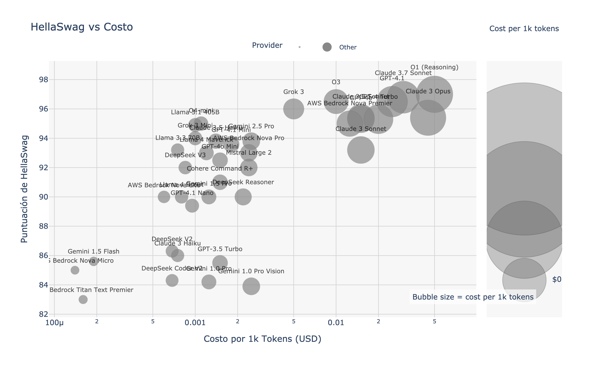
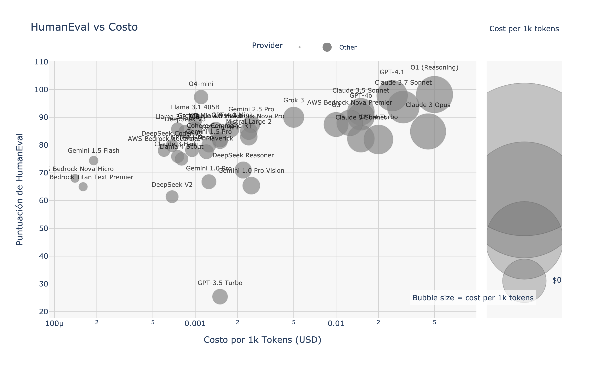

# Guía de Comparación de LLMs para LangChain

*[English](./README.md) | [Português](./README.pt.md)*

Esta guía ayuda a los desarrolladores del ecosistema LangChain a elegir el modelo de lenguaje (LLM) más adecuado para sus proyectos, basándose en el costo, rendimiento y capacidades específicas.

## Resumen Ejecutivo

Esta guía compara modelos compatibles con LangChain de OpenAI, Anthropic, Google y DeepSeek. Puntos destacados:

- **DeepSeek V3** ofrece la mejor relación costo-calidad (~$0,07 USD/millón de tokens con ~88% MMLU)
- **GPT-4 Turbo** y **Claude 3 Opus** lideran en precisión absoluta en HellaSwag (~95%) y generación de código HumanEval (~96%)
- **Gemini Flash 1.5** es la opción multimodal más económica con contexto de 1M tokens y baja latencia

Elija su modelo según los requisitos específicos de su proyecto LangChain.

---

## 1. Modelos, costos y benchmarks clave

| Plataforma | Modelo | **Costo**<br>(USD / 1K tokens, prom. entrada+salida) | MMLU<br>(5-shot, %) | HellaSwag<br>(10-shot, %) | HumanEval<br>(pass@1, %) | Nombre en LangChain |
|---------|-------|----------------------|-------|---------|-----------|----------------|
| **OpenAI** | GPT-4 Turbo | **0,020** | 86,4 | **95,3** | **96,3** | `gpt-4-turbo` |
|  | GPT-3.5 Turbo | 0,0015 | 70,0 | 85,5 | 25,4 | `gpt-3.5-turbo` |
| **Anthropic** | Claude 3 Opus | **0,045** | 86,8 | 95,4 | 84,9 | `claude-3-opus-20240229` |
|  | Claude 3 Haiku | 0,00075 | 75,2 | ~86 | 75,9 | `claude-3-haiku-20240307` |
| **DeepSeek** | DeepSeek V3 | **0,000685** | **88,5** | 88,9 | 65,2 | `deepseek-chat` |
|  | DeepSeek R1 | 0,00219 | 90,8 (MMLU-Redux) | 90 ±0,5 | 69 – 73 | `deepseek-reasoner` |
| **Google** | Gemini Flash 1.5 | **0,00019** | 78,7 | 85,6 | 74,4 | `gemini-1.5-flash` |
|  | Gemini Pro 2 | 0,00125 | 84,1 | ≈ 90* | ≈ 80* | `gemini-1.5-pro` |

> **Nota:** Precios basados en tarifas oficiales para uso exclusivo de texto (promedio de entrada + salida). Los precios de DeepSeek son para **horario estándar**; fuera de horario pico es 50% más barato.

*Datos recopilados y verificados al 24 de abril de 2024.*

---

## 2. Visualización: Costo vs Calidad

| Benchmark | Gráfico |
|-----------|-------|
| MMLU (conocimiento general) |  |
| HellaSwag (comprensión contextual) |  |
| HumanEval (generación de código) |  |

*Gráficos generados el 24 de abril de 2024, basados en benchmarks y precios actuales.*

---

## 3. Guía de selección para casos de uso de LangChain

### Aplicaciones de alto volumen con presupuesto limitado
* **DeepSeek V3** (`deepseek-chat`) - ideal para:
  * Cadenas RAG con recuperación y síntesis de documentos
  * Chatbots de alto volumen que requieren buena precisión
  * Código de complejidad media y automatización de tareas
  * Uso en LangChain: `from langchain_community.chat_models import ChatDeepSeek`

* **Gemini Flash 1.5** (`gemini-1.5-flash`) - ideal para:
  * Procesamiento multimodal económico (texto + imágenes)
  * Cadenas con documentos muy largos (hasta 1M tokens)
  * Uso en LangChain: `from langchain_google_genai import ChatGoogleGenerativeAI`

### Aplicaciones de razonamiento crítico o codificación
* **GPT-4 Turbo** (`gpt-4-turbo`) y **Claude 3 Opus** (`claude-3-opus`) - ideales para:
  * Agentes autónomos que requieren razonamiento complejo
  * Generación de código a nivel de producción
  * Análisis legal, financiero o médico con alto grado de precisión
  * Uso en LangChain: `from langchain_openai import ChatOpenAI` o `from langchain_anthropic import ChatAnthropic`

### Chatbots y asistentes en tiempo real
* **Claude 3 Haiku** (`claude-3-haiku`) y **Gemini Flash** (`gemini-1.5-flash`):
  * Respuestas casi instantáneas (< 3-6s)
  * Buena calidad (por encima del 75% MMLU)
  * Excelente para asistentes conversacionales interactivos
  * Fácil implementación en cadenas conversacionales de LangChain

### Prototipado rápido
* **GPT-3.5 Turbo** (`gpt-3.5-turbo`):
  * Perfecto para MVPs y pruebas de concepto
  * Extremadamente económico para validación inicial de aplicaciones
  * Calidad aceptable (70% MMLU) para muchos casos de uso
  * Integración fácil: `from langchain_openai import ChatOpenAI`

---

## 4. Implementación en LangChain

### Python
```python
# Ejemplo: Inicializando diferentes modelos en LangChain
from langchain_openai import ChatOpenAI
from langchain_anthropic import ChatAnthropic
from langchain_google_genai import ChatGoogleGenerativeAI
from langchain_community.chat_models import ChatDeepSeek

# OpenAI
gpt4_turbo = ChatOpenAI(model="gpt-4-turbo")
gpt35_turbo = ChatOpenAI(model="gpt-3.5-turbo")

# Anthropic
claude_opus = ChatAnthropic(model="claude-3-opus-20240229")
claude_haiku = ChatAnthropic(model="claude-3-haiku-20240307")

# Google
gemini_flash = ChatGoogleGenerativeAI(model="gemini-1.5-flash")
gemini_pro = ChatGoogleGenerativeAI(model="gemini-1.5-pro")

# DeepSeek
deepseek_chat = ChatDeepSeek(model="deepseek-chat")
deepseek_reasoner = ChatDeepSeek(model="deepseek-reasoner")
```

### TypeScript/JavaScript
```typescript
// Ejemplo: Inicializando diferentes modelos en LangChain.js
import { ChatOpenAI } from "@langchain/openai";
import { ChatAnthropic } from "@langchain/anthropic";
import { ChatGoogleGenerativeAI } from "@langchain/google-genai";
import { ChatDeepSeek } from "langchain/chat_models/deepseek";

// OpenAI
const gpt4Turbo = new ChatOpenAI({ modelName: "gpt-4-turbo" });
const gpt35Turbo = new ChatOpenAI({ modelName: "gpt-3.5-turbo" });

// Anthropic
const claudeOpus = new ChatAnthropic({ modelName: "claude-3-opus-20240229" });
const claudeHaiku = new ChatAnthropic({ modelName: "claude-3-haiku-20240307" });

// Google
const geminiFlash = new ChatGoogleGenerativeAI({ modelName: "gemini-1.5-flash" });
const geminiPro = new ChatGoogleGenerativeAI({ modelName: "gemini-1.5-pro" });

// DeepSeek
const deepseekChat = new ChatDeepSeek({ modelName: "deepseek-chat" });
const deepseekReasoner = new ChatDeepSeek({ modelName: "deepseek-reasoner" });
```

---

## 5. Recursos para desarrolladores de LangChain

| Recurso | Utilidad |
|----------|------------------|
| **Integraciones de Proveedores de Modelos LangChain** | Documentación oficial para integraciones de LLM con LangChain |
| **Open LLM Leaderboard** | Benchmarks actualizados para MMLU, HellaSwag y ARC para +200 modelos |
| **Documentación de API DeepSeek** | Información actualizada sobre precios y descuentos fuera de horario pico |
| **Foro de Desarrolladores de Google AI** | Discusiones sobre precios de tokens y latencia para modelos Gemini |
| **Referencia de API Claude de Anthropic** | Documentación oficial sobre ventanas de contexto y parámetros |

Los proveedores actualizan precios y lanzan nuevos modelos con frecuencia – DeepSeek y Google han anunciado posibles cambios de precio cada trimestre.

*Última actualización: 24 de abril de 2024*