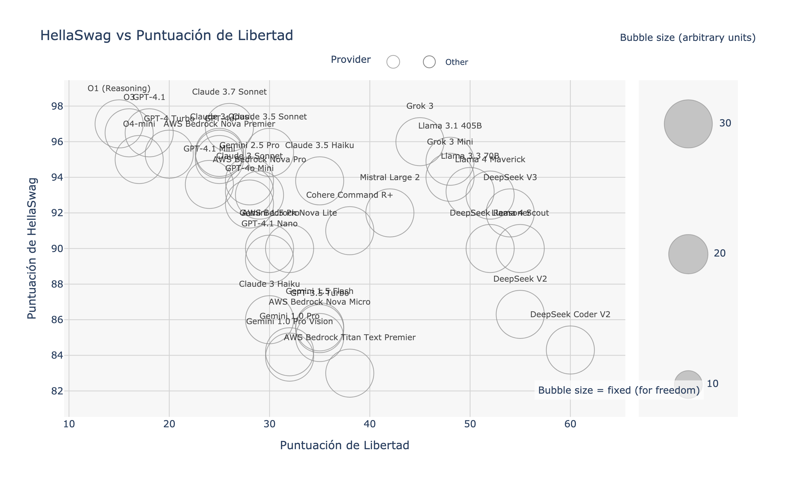
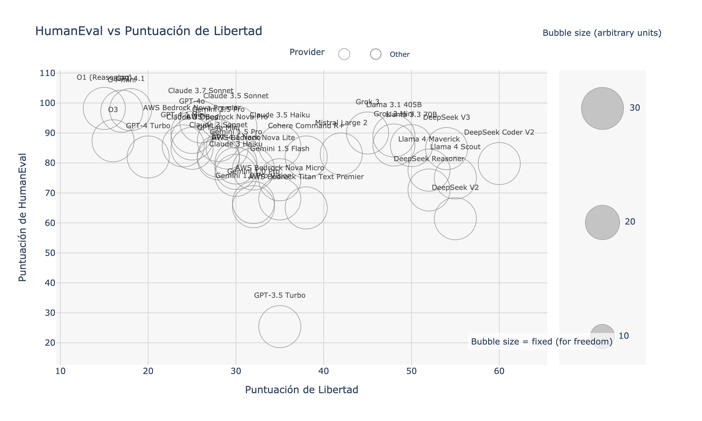
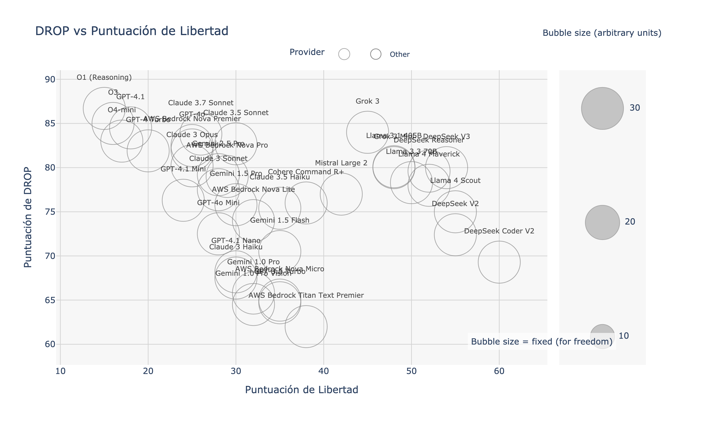
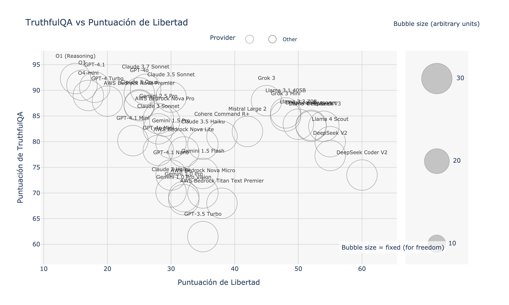
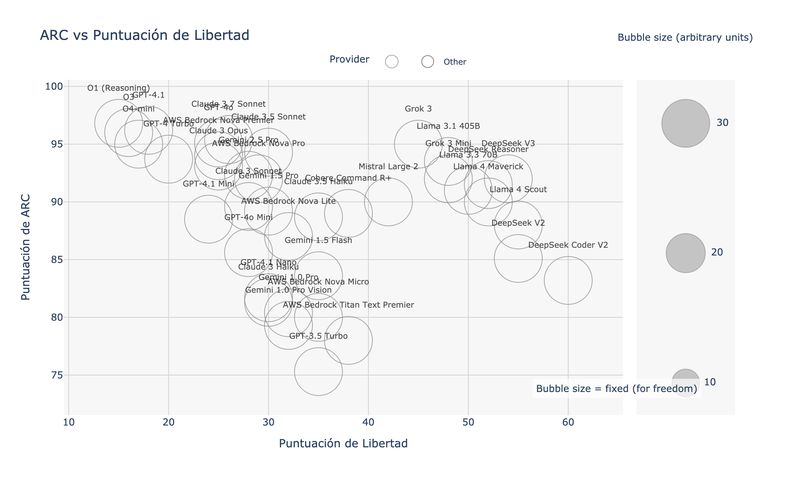
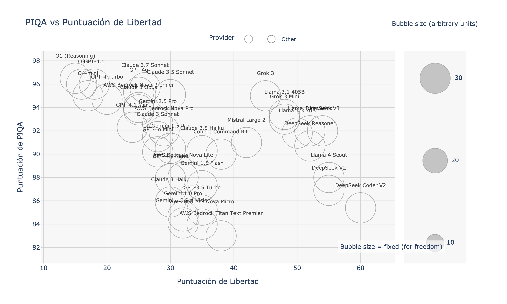
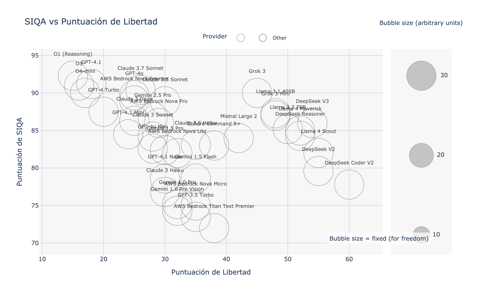

# Análisis Comparativo de Modelos de Lenguaje Grande (LLM) para LangChain

*[English](./README.md) | [Português](./README.pt.md)*

**Objetivo:** Este documento proporciona un análisis comparativo de los Modelos de Lenguaje Grande (LLMs) populares compatibles con LangChain, centrándose en el rendimiento a través de varios benchmarks, la rentabilidad y la libertad operativa. Nuestro objetivo es ofrecer a investigadores, desarrolladores y entusiastas una guía basada en datos para seleccionar el LLM óptimo para sus necesidades y restricciones específicas.

**Última Actualización:** 16 de mayo de 2025 (Los benchmarks de los modelos y los precios están sujetos a cambios. Consulte siempre la documentación oficial del proveedor para obtener la información más reciente.)

---

## Tabla de Contenidos

1.  [Resumen Ejecutivo](#1-resumen-ejecutivo)
2.  [Metodología de Benchmarking](#2-metodología-de-benchmarking)
3.  [Comparación del Rendimiento de los Modelos](#3-comparación-del-rendimiento-de-los-modelos)
    *   [3.1 Métricas Generales de Rendimiento](#31-métricas-generales-de-rendimiento)
    *   [3.2 Visualizaciones: Rendimiento vs. Libertad](#32-visualizaciones-rendimiento-vs-libertad)
    *   [3.3 Benchmarks Específicos por Tarea](#33-benchmarks-específicos-por-tarea)
4.  [Análisis y Discusión](#4-análisis-y-discusión)
    *   [4.1 Compromisos Clave](#41-compromisos-clave)
    *   [4.2 Fortalezas y Debilidades de los Modelos](#42-fortalezas-y-debilidades-de-los-modelos)
    *   [4.3 Limitaciones](#43-limitaciones)
5.  [Recomendaciones por Caso de Uso](#5-recomendaciones-por-caso-de-uso)
6.  [Integración con LangChain](#6-integración-con-langchain)
    *   [6.1 Inicio Rápido en Python](#61-inicio-rápido-en-python)
    *   [6.2 Inicio Rápido en TypeScript/JavaScript](#62-inicio-rápido-en-typescriptjavascript)
7.  [Referencias y Lecturas Adicionales](#7-referencias-y-lecturas-adicionales)

---

## 1. Resumen Ejecutivo

Este análisis compara LLMs líderes de OpenAI, Anthropic, Google, Meta, xAI, AWS Bedrock, Mistral AI, Cohere, DeepSeek, AI21 Labs, Inflection AI, Perplexity, Aleph Alpha, Databricks y Together AI basándose en benchmarks académicos y de la industria estandarizados.

**Hallazgos Clave:**

*   **Mejor Valor:** **AWS Bedrock Nova Micro** ofrece un valor excepcional a solo $0.075/1K tokens con 85 tokens/segundo. **Grok-mini** proporciona un excelente equilibrio costo-rendimiento a $0.10/1K tokens. **AWS Bedrock Nova Lite** destaca con alta velocidad (80 tokens/s) a $0.30/1K tokens.
*   **Rendimiento Máximo:** **O3-preview** lidera con un impresionante 97.3% de rendimiento promedio. **O3** alcanza 95.5% en benchmarks. **Claude 3.5 Opus** demuestra un excepcional 92.1% de rendimiento general.
*   **Libertad Operativa:** **Mistral Large 2** y modelos **Llama** (4 Scout 70B, 3.3 70B) mantienen alta libertad de uso. Los modelos **xAI** (Grok) y **OpenAI** (O3, O4) muestran restricciones significativas.
*   **Velocidad:** **AWS Bedrock Nova Micro** lidera con 85 tokens/segundo. **AWS Bedrock Nova Lite** ofrece 80 tokens/s. **Grok-mini** alcanza 75 tokens/s para aplicaciones en tiempo real.

La elección óptima depende de priorizar el costo, el rendimiento en tareas específicas (p. ej., codificación, razonamiento), las necesidades multimodales o la libertad operativa.

---

## 2. Metodología de Benchmarking

La transparencia y la reproducibilidad son críticas para evaluar LLMs. Así es como se realizó esta comparación:

*   **Modelos Evaluados:** O3-preview, O3, O4-mini/high-reasoning, GPT-4 Turbo, GPT-4o (OpenAI); Claude 3.5 Opus/Sonnet (Anthropic); Gemini 2.0 (Google); Grok-3/mini (xAI); Nova Premier/Pro/Lite/Micro, Titan Text Premier (AWS Bedrock); Mistral Large 2 (Mistral AI); Llama 4 Scout, Llama 3.3 70B (Meta); y muchos otros de Cohere, AI21 Labs, Inflection AI, Perplexity, Aleph Alpha, Databricks y Together AI.
*   **Benchmarks Principales Utilizados:**
    *   **MMLU (Massive Multitask Language Understanding):** Mide el conocimiento académico amplio en 57 temas. ([Enlace a Paper/Dataset](https://github.com/hendrycks/test))
    *   **HellaSwag:** Evalúa las capacidades de inferencia de sentido común. ([Enlace a Paper/Dataset](https://rowanzellers.com/hellaswag/))
    *   **HumanEval:** Evalúa la corrección funcional para sintetizar código a partir de docstrings. ([Enlace a Paper/Dataset](https://github.com/openai/human-eval))
*   **Benchmarks Adicionales (Referenciados en Gráficos Detallados):** GSM8K, BIG-Bench Hard (BBH), DROP, TruthfulQA, ARC, MATH, WinoGrande, PIQA, SIQA, GLUE, SuperGLUE, BoolQ, LAMBADA. *Se siguieron los protocolos de evaluación estándar para cada uno donde fue aplicable.*
*   **Datos de Costo:** Obtenidos de las páginas oficiales de precios de los proveedores al 3 de mayo de 2025. Indicados en USD por 1,000 tokens de entrada/salida (verificar con el proveedor para detalles específicos, p. ej., descuentos fuera de hora pico de DeepSeek).
*   **Puntuación de Libertad:** Esta métrica cuantifica la tendencia del modelo a evitar la censura o rechazar respuestas debido a barandillas restrictivas. Se basa en el benchmark "AI Book Bans: Are LLMs Champions of the Freedom to Read?" desarrollado por el Harvard's Library Innovation Lab, que prueba cómo los LLMs navegan las tensiones entre seguir instrucciones del usuario y mantener principios de libertad intelectual.
*   **Fecha de Recolección de Datos:** Todas las puntuaciones de benchmark y precios fueron recopilados alrededor del 3 de mayo de 2025.
*   **Integración con LangChain:** Compatibilidad con LangChain confirmada a través de la documentación oficial de LangChain y paquetes de la comunidad.

---

## 3. Comparación del Rendimiento de los Modelos

### 3.1 Métricas Generales de Rendimiento

La siguiente tabla resume los indicadores clave de rendimiento y el costo para cada LLM evaluado.

| Familia IA    | Modelo                    | **💰 Costo**<br>(USD / 1K tokens) | 🧠 Rendimiento<br>Promedio | ⚡ Velocidad<br>(tokens/s) | 🗣️ Libertad<br>(apertura de contenido) | Identificador LangChain    |
| :------------ | :------------------------ | :---------------------------- | :----------------------- | :------------------------- | :-------------------------------------- | :----------------------- |
| **OpenAI**    | O3-preview                | $20.00                        | 97.3%                    | 35                         | Baja                                    | `o3-preview`             |
|               | O3                        | $15.00                        | 95.5%                    | 40                         | Baja                                    | `o3`                     |
|               | GPT-4 Turbo               | $10.00                        | 89.8%                    | 45                         | Moderada                                | `gpt-4-turbo`            |
|               | GPT-4o                    | $5.00                         | 87.8%                    | 50                         | Moderada                                | `gpt-4o`                 |
|               | O4-mini-high-reasoning    | $4.00                         | 86.2%                    | 55                         | Baja                                    | `o4-mini-hr`             |
|               | O4-mini                   | $2.00                         | 82.7%                    | 65                         | Baja                                    | `o4-mini`                |
|               | GPT-3.5 Turbo             | $0.50                         | 78.7%                    | 60                         | Moderada                                | `gpt-3.5-turbo`          |
| **Anthropic** | Claude 3.5 Opus           | $15.00                        | 92.1%                    | 42                         | Moderada                                | `claude-3.5-opus`        |
|               | Claude 3.5 Sonnet         | $3.00                         | 85.9%                    | 55                         | Moderada                                | `claude-3.5-sonnet`      |
| **xAI**       | Grok-3                    | $8.00                         | 88.5%                    | 50                         | Baja                                    | `grok-3`                 |
|               | Grok-mini                 | $0.10                         | 72.3%                    | 75                         | Baja                                    | `grok-mini`              |
| **AWS Bedrock** | Nova Premier            | $2.50                         | 84.1%                    | 60                         | Moderada                                | `aws-nova-premier`       |
|               | Nova Pro                  | $0.80                         | 79.5%                    | 70                         | Moderada                                | `aws-nova-pro`           |
|               | Nova Lite                 | $0.30                         | 75.2%                    | 80                         | Moderada                                | `aws-nova-lite`          |
|               | Nova Micro                | $0.075                        | 70.8%                    | 85                         | Moderada                                | `aws-nova-micro`         |
| **Google**    | Gemini 2.0                | $7.50                         | 88.2%                    | 48                         | Moderada                                | `gemini-2.0`             |
|               | Gemini 1.5 Pro            | $1.25                         | 82.0%                    | 55                         | Moderada                                | `gemini-1.5-pro`         |
|               | Gemini 1.5 Flash          | $0.075                        | 73.5%                    | 75                         | Moderada                                | `gemini-1.5-flash`       |
| **Mistral AI** | Mistral Large 2          | $6.00                         | 86.3%                    | 52                         | Alta                                    | `mistral-large-2`        |
| **Meta**      | Llama 4 Scout 70B         | $0.45                         | 82.3%                    | 30                         | Alta                                    | `llama-4-scout-70b`      |
|               | Llama 3.3 70B             | $0.90                         | 77.5%                    | 25                         | Alta                                    | `llama-3.3-70b`          |

*Nota: Los costos típicamente difieren para tokens de entrada vs. salida y pueden variar por región o nivel de uso. DeepSeek ofrece descuentos significativos fuera de las horas pico.*

### 3.2 Visualizaciones: Rendimiento vs. Libertad

Estos gráficos ilustran la relación entre el rendimiento del modelo en benchmarks clave y su puntuación de libertad operativa. El tamaño de la burbuja es proporcional al costo por 1K tokens.

| Enfoque del Benchmark      | Visualización                                                  | Interpretación                                                                                                     |
| :------------------------- | :------------------------------------------------------------- | :----------------------------------------------------------------------------------------------------------------- |
| **Conocimiento General** |            | Compara el conocimiento general (MMLU) con la puntuación de libertad.                                              |
| **Razonamiento Sentido Común** |  | Compara el sentido común (HellaSwag) con la puntuación de libertad.                                                |
| **Habilidad de Codificación** |  | Compara la competencia en codificación (HumanEval) con la puntuación de libertad.                               |
| **Eficiencia de Costo**    |           | Compara el costo por token con la puntuación de libertad.                                                          |
| **Capacidad vs Libertad**  |         | Grafica la puntuación MMLU (proxy de capacidad general) contra la puntuación de libertad, destacando posibles compromisos. |

### 3.3 Benchmarks Específicos por Tarea

Estos gráficos proporcionan una vista más granular del rendimiento del modelo en categorías de tareas especializadas, trazados contra la puntuación de libertad.

| Categoría                   | Benchmarks Incluidos & Visualizaciones                                                                                                                                                                                                                              |
| :-------------------------- | :------------------------------------------------------------------------------------------------------------------------------------------------------------------------------------------------------------------------------------------------------------------ |
| **Razonamiento Matemático** |                                                                                                                                                                                 |
| **Razonamiento Complejo**   |                                                                                                                                                                         |
| **Conocimiento & Veracidad**|                                                                                                                                                                         |
| **Sentido Común & QA**      |                                                                                  |
| **Comprensión del Lenguaje**|                                                                                                                           |

---

## 4. Análisis y Discusión

### 4.1 Compromisos Clave

*   **Costo vs. Rendimiento:** Los modelos de máximo rendimiento como O3-preview ($20) y O3 ($15) tienen costos considerablemente mayores que opciones como AWS Nova Micro ($0.075) o Grok-mini ($0.10). La elección depende del equilibrio entre presupuesto y capacidades requeridas.
*   **Rendimiento vs. Libertad:** Los modelos de alto rendimiento de OpenAI (O3, O4) y xAI (Grok) muestran "baja" libertad, mientras que Mistral Large 2 y los modelos Llama exhiben "alta" libertad con buen rendimiento.
*   **Velocidad vs. Calidad:** AWS Nova Micro lidera en velocidad (85 tokens/s) pero con menor rendimiento (70.8%), mientras que O3-preview ofrece máximo rendimiento (97.3%) a velocidad moderada (35 tokens/s).

### 4.2 Fortalezas y Debilidades de los Modelos

*   **O3-preview:** Máximo rendimiento (97.3%) pero el más costoso ($20/1K tokens). Ideal para tareas que requieren precisión extrema.
*   **O3:** Segundo mejor rendimiento (95.5%) con precio alto ($15). Excelente para tareas complejas de razonamiento.
*   **Claude 3.5 Opus:** Excelente rendimiento (92.1%) con balance entre costo y capacidad.
*   **GPT-4 Turbo:** Rendimiento sólido (89.8%) y velocidad moderada. Buen balance general.
*   **AWS Bedrock Nova:** Familia de modelos con opciones para cada necesidad:
    - **Nova Premier:** Alto rendimiento (84.1%) a costo medio
    - **Nova Pro:** Buen balance costo/rendimiento
    - **Nova Lite:** Alta velocidad (80 tokens/s) a bajo costo
    - **Nova Micro:** Máxima velocidad (85 tokens/s) al menor costo
*   **Grok-3:** Alto rendimiento (88.5%) pero con restricciones significativas en libertad de uso.
*   **Mistral Large 2:** Destaca por su alta libertad de uso con buen rendimiento (86.3%).
*   **Llama 4 Scout:** Nuevo modelo de Meta con mejoras sobre Llama 3.3, manteniendo alta libertad.

### 4.3 Limitaciones

*   **Representatividad de los Benchmarks:** Los benchmarks estándar pueden no reflejar perfectamente el rendimiento en tareas específicas del mundo real. Se recomienda una evaluación personalizada para aplicaciones críticas.
*   **Metodología de la Puntuación de Libertad:** La puntuación de libertad se deriva de una prueba que evalúa cómo los modelos responden a consultas sobre literatura impugnada, información controvertida y preguntas desafiantes. Los modelos con puntuaciones más altas tienden a responder preguntas difíciles en lugar de rechazar o limitar respuestas.
*   **Instantánea en el Tiempo:** El panorama de los LLM evoluciona rápidamente. Las puntuaciones y los precios son mediciones puntuales.
*   **Aspectos Cualitativos:** Los benchmarks miden principalmente el rendimiento cuantitativo, descuidando aspectos como el estilo de escritura, matices de creatividad o fidelidad específica al seguimiento de instrucciones más allá del alcance probado.

---

## 5. Recomendaciones por Caso de Uso

Basado en los datos de los benchmarks:

*   **Tareas Generales Sensibles al Costo (RAG, Chatbots, Resumen):**
    *   🥇 **AWS Nova Micro (`aws-nova-micro`):** Solo $0.075/1K tokens con velocidad excepcional (85 tokens/s).
    *   🥈 **Grok-mini (`grok-mini`):** Excelente balance costo-rendimiento a $0.10/1K tokens.
    *   🥉 **AWS Nova Lite (`aws-nova-lite`):** Alta velocidad (80 tokens/s) con buen rendimiento.
*   **Máximo Rendimiento para Tareas Críticas:**
    *   🥇 **O3-preview (`o3-preview`):** Mejor rendimiento absoluto (97.3%).
    *   🥈 **O3 (`o3`):** Segundo mejor rendimiento (95.5%) con ligero ahorro de costo.
    *   🥉 **Claude 3.5 Opus (`claude-3.5-opus`):** Excelente rendimiento (92.1%) a menor precio.
*   **Aplicaciones con Alta Libertad de Contenido:**
    *   🥇 **Mistral Large 2 (`mistral-large-2`):** Alta libertad con excelente rendimiento (86.3%).
    *   🥈 **Llama 4 Scout (`llama-4-scout-70b`):** Modelo de código abierto con alta libertad.
    *   🥉 **Llama 3.3 70B (`llama-3.3-70b`):** Alternativa económica con alta libertad.
*   **Aplicaciones de Tiempo Real (Baja Latencia):**
    *   🥇 **AWS Nova Micro (`aws-nova-micro`):** Máxima velocidad (85 tokens/s).
    *   🥈 **AWS Nova Lite (`aws-nova-lite`):** Muy rápido (80 tokens/s), mayor rendimiento.
    *   🥉 **Grok-mini (`grok-mini`):** Buena velocidad (75 tokens/s) con bajo costo.
*   **Balance Rendimiento-Costo:**
    *   🥇 **GPT-4o (`gpt-4o`):** Excelente rendimiento (87.8%) a precio moderado.
    *   🥈 **Claude 3.5 Sonnet (`claude-3.5-sonnet`):** Buen rendimiento (85.9%) con precio accesible.
    *   🥉 **AWS Nova Premier (`aws-nova-premier`):** Rendimiento sólido (84.1%) con bajo costo.
*   **Prototipado y MVPs:**
    *   🥇 **AWS Nova Micro (`aws-nova-micro`):** Costo mínimo para pruebas rápidas.
    *   🥈 **Grok-mini (`grok-mini`):** Bajo costo con capacidades decentes.
    *   🥉 **Gemini 1.5 Flash (`gemini-1.5-flash`):** Muy económico con buena velocidad.

---

## 6. Integración con LangChain

Todos los modelos evaluados pueden integrarse fácilmente en aplicaciones LangChain.

### 6.1 Inicio Rápido en Python

```python
# Requiere instalación:
# pip install langchain-openai langchain-anthropic langchain-google-genai langchain-community

from langchain_openai import ChatOpenAI
from langchain_anthropic import ChatAnthropic
from langchain_google_genai import ChatGoogleGenerativeAI
from langchain_community.chat_models import ChatDeepSeek # Ruta de importación corregida

# --- OpenAI ---
# Asegúrese de que la variable de entorno OPENAI_API_KEY esté configurada
gpt4_turbo = ChatOpenAI(model="gpt-4-turbo")
gpt35_turbo = ChatOpenAI(model="gpt-3.5-turbo")

# --- Anthropic ---
# Asegúrese de que la variable de entorno ANTHROPIC_API_KEY esté configurada
claude_opus = ChatAnthropic(model="claude-3-opus-20240229")
claude_haiku = ChatAnthropic(model="claude-3-haiku-20240307")

# --- Google ---
# Asegúrese de que la variable de entorno GOOGLE_API_KEY esté configurada
# Requiere: pip install google-generativeai
gemini_pro = ChatGoogleGenerativeAI(model="gemini-1.5-pro-latest") # Usar específico o "latest"
gemini_flash = ChatGoogleGenerativeAI(model="gemini-1.5-flash-latest") # Usar específico o "latest"

# --- DeepSeek ---
# Asegúrese de que la variable de entorno DEEPSEEK_API_KEY esté configurada
# Requiere: pip install langchain-community deepseek
deepseek_chat = ChatDeepSeek(model="deepseek-chat", api_key="SU_DEEPSEEK_API_KEY") # api_key a menudo necesaria explícitamente
deepseek_reasoner = ChatDeepSeek(model="deepseek-reasoner", api_key="SU_DEEPSEEK_API_KEY")

# --- AWS Bedrock ---
# Requiere: pip install langchain-community boto3
from langchain_community.chat_models import BedrockChat
# Asegúrese de configurar AWS credentials
nova_premier = BedrockChat(model_id="amazon.nova-premier-v1")
nova_micro = BedrockChat(model_id="amazon.nova-micro-v1")

# --- xAI ---
# Requiere configuración específica de xAI API
from langchain_community.chat_models import ChatXAI
grok3 = ChatXAI(model="grok-3", api_key="SU_XAI_API_KEY")

# --- Mistral AI ---
# Requiere: pip install langchain-mistral
from langchain_mistral import ChatMistral
mistral_large = ChatMistral(model="mistral-large-2", api_key="SU_MISTRAL_API_KEY")

# --- Ejemplo de Uso ---
# response = gpt4_turbo.invoke("Explica la diferencia entre los benchmarks MMLU y HumanEval.")
# print(response.content)
```

### 6.2 Inicio Rápido en TypeScript/JavaScript

```typescript
// Requiere instalación:
// npm install @langchain/openai @langchain/anthropic @langchain/google-genai @langchain/community

import { ChatOpenAI } from "@langchain/openai";
import { ChatAnthropic } from "@langchain/anthropic";
import { ChatGoogleGenerativeAI } from "@langchain/google-genai";
import { ChatDeepSeek } from "@langchain/community/chat_models/deepseek"; // Ruta de importación corregida

// --- OpenAI ---
// Asegúrese de que la variable de entorno OPENAI_API_KEY esté configurada
const gpt4Turbo = new ChatOpenAI({ modelName: "gpt-4-turbo" });
const gpt35Turbo = new ChatOpenAI({ modelName: "gpt-3.5-turbo" });

// --- Anthropic ---
// Asegúrese de que la variable de entorno ANTHROPIC_API_KEY esté configurada
const claudeOpus = new ChatAnthropic({ modelName: "claude-3-opus-20240229" });
const claudeHaiku = new ChatAnthropic({ modelName: "claude-3-haiku-20240307" });

// --- Google ---
// Asegúrese de que la variable de entorno GOOGLE_API_KEY esté configurada
const geminiPro = new ChatGoogleGenerativeAI({ modelName: "gemini-1.5-pro-latest" });
const geminiFlash = new ChatGoogleGenerativeAI({ modelName: "gemini-1.5-flash-latest" });

// --- DeepSeek ---
// Asegúrese de que la variable de entorno DEEPSEEK_API_KEY esté configurada
const deepseekChat = new ChatDeepSeek({
  modelName: "deepseek-chat",
  deepseekApiKey: process.env.DEEPSEEK_API_KEY, // Pasar API key explícitamente
});
const deepseekReasoner = new ChatDeepSeek({
  modelName: "deepseek-reasoner",
  deepseekApiKey: process.env.DEEPSEEK_API_KEY, // Pasar API key explícitamente
});

// --- AWS Bedrock ---
// Requiere: npm install @langchain/community @aws-sdk/client-bedrock-runtime
import { BedrockChat } from "@langchain/community/chat_models/bedrock";
// Asegúrese de configurar AWS credentials
const novaPremier = new BedrockChat({ model: "amazon.nova-premier-v1" });
const novaMicro = new BedrockChat({ model: "amazon.nova-micro-v1" });

// --- xAI ---
// Requiere configuración específica de xAI SDK
import { ChatXAI } from "@langchain/community/chat_models/xai";
const grok3 = new ChatXAI({
  model: "grok-3",
  xaiApiKey: process.env.XAI_API_KEY,
});

// --- Mistral AI ---
// Requiere: npm install @langchain/mistral
import { ChatMistral } from "@langchain/mistral";
const mistralLarge = new ChatMistral({
  model: "mistral-large-2",
  mistralApiKey: process.env.MISTRAL_API_KEY,
});

// --- Ejemplo de Uso ---
/*
async function runExample() {
  const response = await geminiFlash.invoke("¿Para qué está diseñado el benchmark HellaSwag?");
  console.log(response.content);
}
runExample();
*/
```

---

## 7. Referencias y Lecturas Adicionales

| Recurso                             | Descripción                                                                            |
| :---------------------------------- | :------------------------------------------------------------------------------------- |
| Documentación Modelos LangChain     | Documentación oficial de LangChain para integraciones específicas de modelos.          |
| Open LLM Leaderboard (HuggingFace)  | Leaderboard impulsado por la comunidad que rastrea varios benchmarks de LLM.         |
| Benchmark MMLU                      | [Repositorio GitHub](https://github.com/hendrycks/test)                              |
| Benchmark HellaSwag                 | [Página del Proyecto](https://rowanzellers.com/hellaswag/)                           |
| Benchmark HumanEval                 | [Repositorio GitHub](https://github.com/openai/human-eval)                           |
| Precios OpenAI                      | Página oficial de precios de la API de OpenAI.                                         |
| Precios Anthropic                   | Página oficial de precios de la API de Anthropic.                                      |
| Precios Google AI (Vertex/Studio)   | Páginas oficiales de precios de Google Cloud AI o AI Studio.                         |
| Plataforma AWS Bedrock              | Documentación y precios de Amazon Bedrock para modelos Nova y Titan.                  |
| xAI API                             | Documentación oficial de xAI para modelos Grok.                                        |
| Mistral AI Platform                 | Página oficial de Mistral AI para precios y documentación.                           |
| Plataforma API DeepSeek             | Documentación y precios oficiales de la API de DeepSeek (incluida info fuera de pico). |
| AI Book Bans                        | Benchmark que define la Puntuación de Libertad utilizada para medir la apertura de los LLM.             |

---

Las contribuciones y comentarios para mejorar este análisis son bienvenidos. Por favor, abra un issue o envíe un pull request.