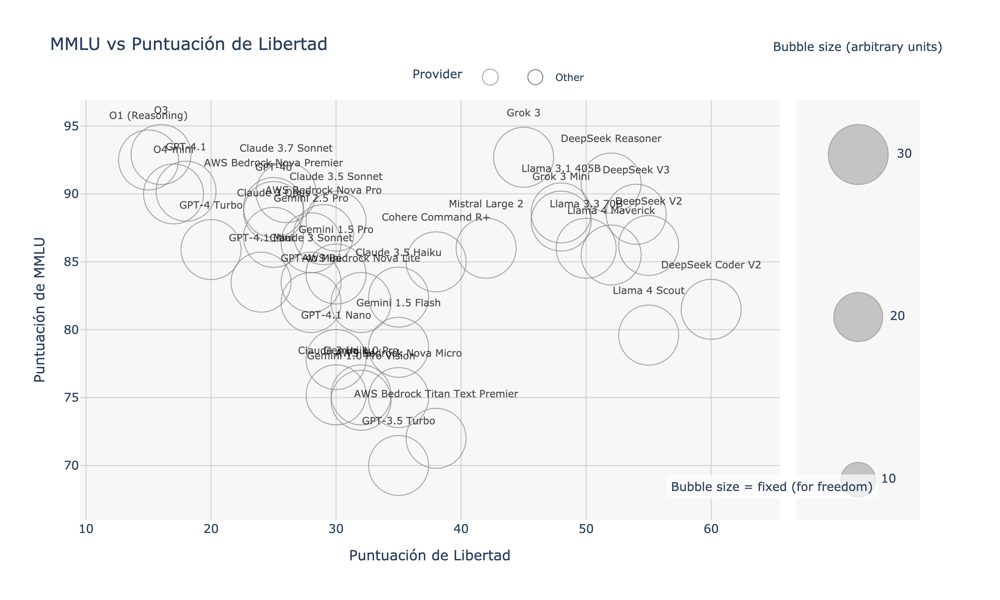
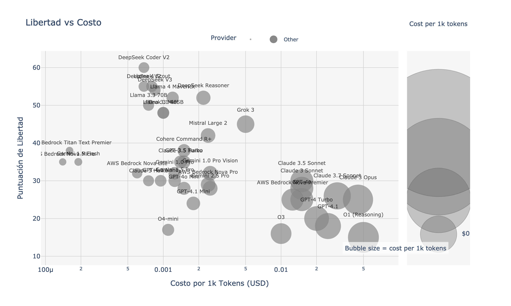
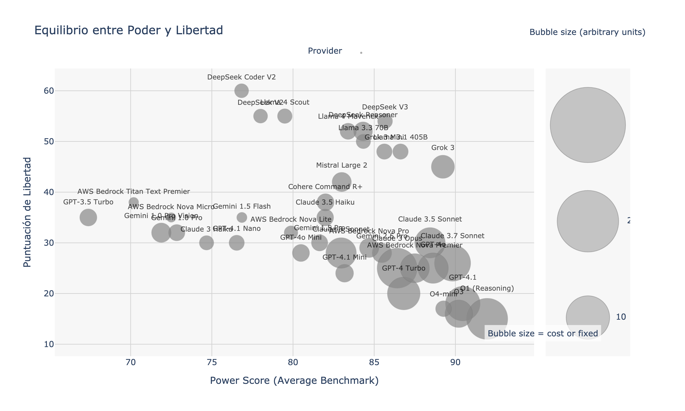
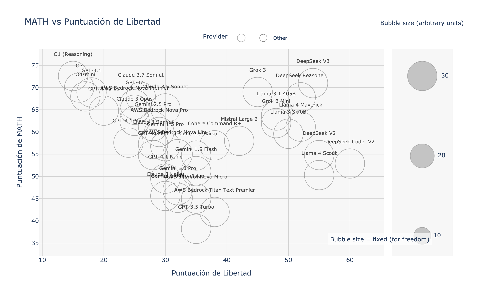
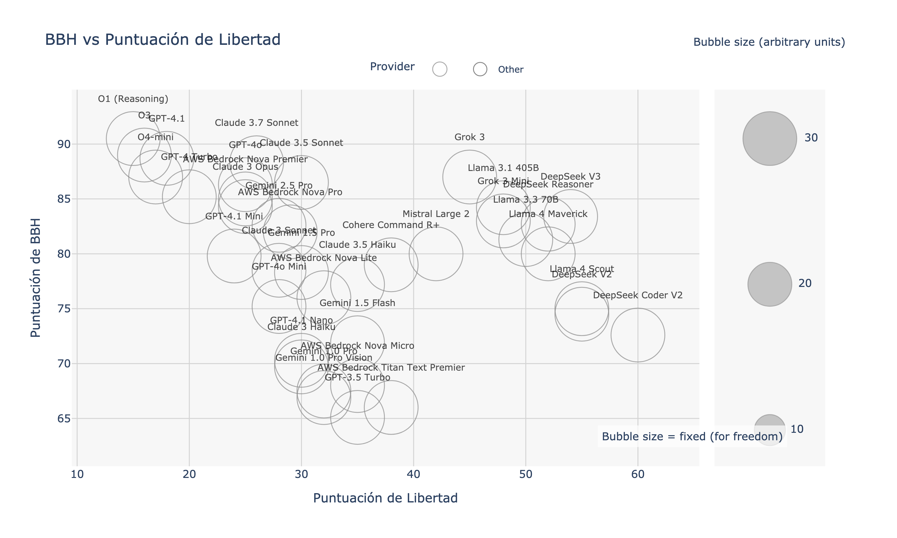
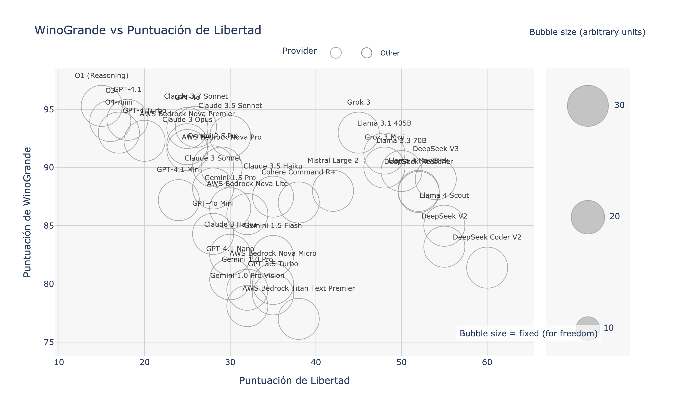
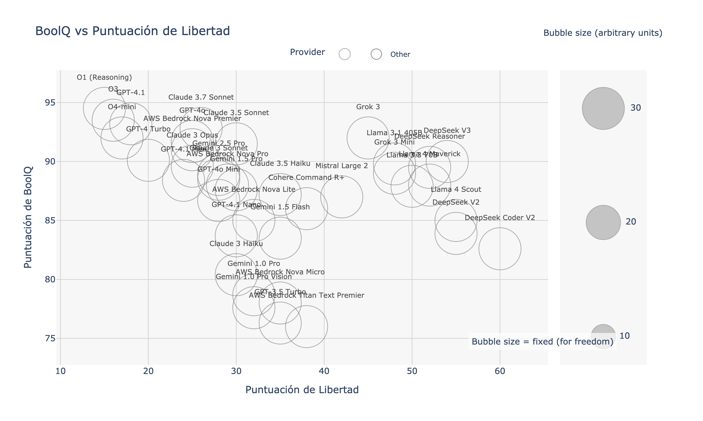
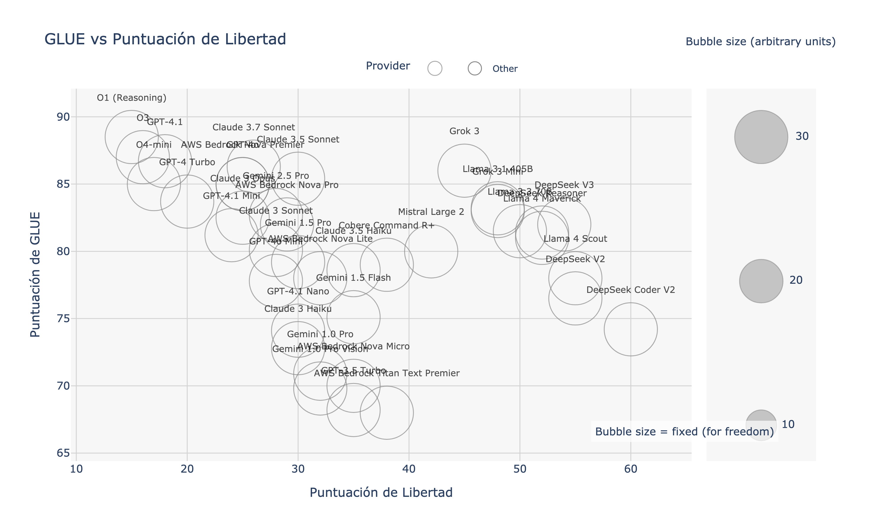
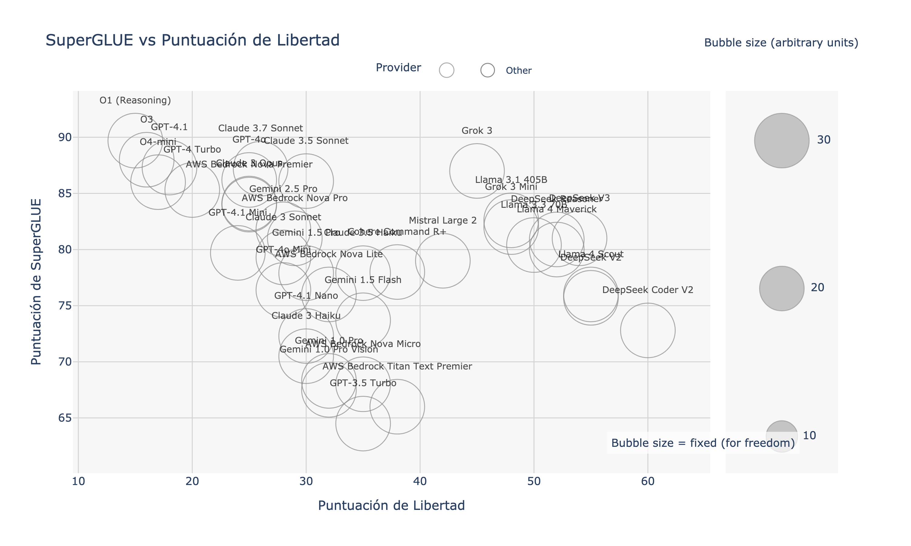

# Análisis Comparativo de Modelos de Lenguaje Grande (LLM) para LangChain

*[English](./README.md) | [Português](./README.pt.md)*

**Objetivo:** Este documento proporciona un análisis comparativo de los Modelos de Lenguaje Grande (LLMs) populares compatibles con LangChain, centrándose en el rendimiento a través de varios benchmarks, la rentabilidad y la libertad operativa. Nuestro objetivo es ofrecer a investigadores, desarrolladores y entusiastas una guía basada en datos para seleccionar el LLM óptimo para sus necesidades y restricciones específicas.

**Última Actualización:** 5 de mayo de 2025 (Los benchmarks de los modelos y los precios están sujetos a cambios. Consulte siempre la documentación oficial del proveedor para obtener la información más reciente.)

---

## Tabla de Contenidos

1.  [Resumen Ejecutivo](#1-resumen-ejecutivo)
2.  [Metodología de Benchmarking](#2-metodología-de-benchmarking)
3.  [Comparación del Rendimiento de los Modelos](#3-comparación-del-rendimiento-de-los-modelos)
    *   [3.1 Métricas Generales de Rendimiento](#31-métricas-generales-de-rendimiento)
    *   [3.2 Visualizaciones: Rendimiento vs. Libertad](#32-visualizaciones-rendimiento-vs-libertad)
    *   [3.3 Benchmarks Específicos por Tarea](#33-benchmarks-específicos-por-tarea)
4.  [Análisis y Discusión](#4-análisis-y-discusión)
    *   [4.1 Compromisos Clave](#41-compromisos-clave)
    *   [4.2 Fortalezas y Debilidades de los Modelos](#42-fortalezas-y-debilidades-de-los-modelos)
    *   [4.3 Limitaciones](#43-limitaciones)
5.  [Recomendaciones por Caso de Uso](#5-recomendaciones-por-caso-de-uso)
6.  [Integración con LangChain](#6-integración-con-langchain)
    *   [6.1 Inicio Rápido en Python](#61-inicio-rápido-en-python)
    *   [6.2 Inicio Rápido en TypeScript/JavaScript](#62-inicio-rápido-en-typescriptjavascript)
7.  [Referencias y Lecturas Adicionales](#7-referencias-y-lecturas-adicionales)

---

## 1. Resumen Ejecutivo

Este análisis compara LLMs líderes de OpenAI, Anthropic, Google, Meta (Llama) y DeepSeek basándose en benchmarks académicos y de la industria estandarizados.

**Hallazgos Clave:**

*   **Mejor Valor:** **DeepSeek V2** (`deepseek-chat`) demuestra un valor excepcional, equilibrando un alto rendimiento (86.2% MMLU) con un bajo costo (~$0.0007/1K tokens). **Gemini 1.5 Flash** ofrece el costo general más bajo a $0.00019/1K tokens, con sólidas capacidades multimodales.
*   **Rendimiento Máximo:** **GPT-4.1** ahora lidera en muchas categorías con excepcionales capacidades de codificación (97.8% HumanEval) y razonamiento. **Claude 3.7 Sonnet** demuestra un sobresaliente razonamiento de sentido común (96.8% HellaSwag). **O1 (Reasoning)** y **DeepSeek Reasoner** logran las puntuaciones MMLU más altas (92.5% y 90.8% respectivamente).
*   **Libertad Operativa:** Los modelos **DeepSeek** (Coder V2, V2, Reasoner) y los **modelos Llama** (3.1 405B, 3.3 70B) exhiben puntuaciones de libertad más altas, sugiriendo menos restricciones de contenido en comparación con otros modelos evaluados.
*   **Velocidad:** **Claude 3.5 Haiku**, **Llama 3.3 70B** y **Gemini 1.5 Flash** están optimizados para aplicaciones de baja latencia como chatbots en tiempo real.

La elección óptima depende de priorizar el costo, el rendimiento en tareas específicas (p. ej., codificación, razonamiento), las necesidades multimodales o la libertad operativa.

---

## 2. Metodología de Benchmarking

La transparencia y la reproducibilidad son críticas para evaluar LLMs. Así es como se realizó esta comparación:

*   **Modelos Evaluados:** GPT-4o, GPT-4o Mini, familia GPT-4.1, GPT-4 Turbo, GPT-3.5 Turbo (OpenAI); Claude 3.7/3.5 Sonnet, Claude 3 Opus, Claude 3 Haiku (Anthropic); Gemini 2.5 Pro, Gemini 1.5 Pro, Gemini 1.5 Flash (Google); DeepSeek V2, DeepSeek Coder V2, DeepSeek Reasoner (DeepSeek); Llama 3.1 405B, Llama 3.3 70B (Meta); y O1 (Reasoning) (Anthropic).
*   **Benchmarks Principales Utilizados:**
    *   **MMLU (Massive Multitask Language Understanding):** Mide el conocimiento académico amplio en 57 temas. ([Enlace a Paper/Dataset](https://github.com/hendrycks/test))
    *   **HellaSwag:** Evalúa las capacidades de inferencia de sentido común. ([Enlace a Paper/Dataset](https://rowanzellers.com/hellaswag/))
    *   **HumanEval:** Evalúa la corrección funcional para sintetizar código a partir de docstrings. ([Enlace a Paper/Dataset](https://github.com/openai/human-eval))
*   **Benchmarks Adicionales (Referenciados en Gráficos Detallados):** GSM8K, BIG-Bench Hard (BBH), DROP, TruthfulQA, ARC, MATH, WinoGrande, PIQA, SIQA, GLUE, SuperGLUE, BoolQ, LAMBADA. *Se siguieron los protocolos de evaluación estándar para cada uno donde fue aplicable.*
*   **Datos de Costo:** Obtenidos de las páginas oficiales de precios de los proveedores al 3 de mayo de 2025. Indicados en USD por 1,000 tokens de entrada/salida (verificar con el proveedor para detalles específicos, p. ej., descuentos fuera de hora pico de DeepSeek).
*   **Puntuación de Libertad:** Esta métrica cuantifica la tendencia del modelo a evitar la censura o rechazar respuestas debido a barandillas restrictivas. Se basa en el benchmark "AI Book Bans: Are LLMs Champions of the Freedom to Read?" desarrollado por el Harvard's Library Innovation Lab, que prueba cómo los LLMs navegan las tensiones entre seguir instrucciones del usuario y mantener principios de libertad intelectual.
*   **Fecha de Recolección de Datos:** Todas las puntuaciones de benchmark y precios fueron recopilados alrededor del 3 de mayo de 2025.
*   **Integración con LangChain:** Compatibilidad con LangChain confirmada a través de la documentación oficial de LangChain y paquetes de la comunidad.

---

## 3. Comparación del Rendimiento de los Modelos

### 3.1 Métricas Generales de Rendimiento

La siguiente tabla resume los indicadores clave de rendimiento y el costo para cada LLM evaluado.

| Familia IA    | Modelo             | **💰 Costo**<br>(USD / 1K tokens) | 🧠 MMLU<br>(conocimiento general) | 🔮 HellaSwag<br>(sentido común) | 👩‍💻 HumanEval<br>(habilidades de codificación) | 🗣️ Libertad<br>(apertura de contenido) | Identificador LangChain    |
| :------------ | :----------------- | :--------------------------- | :---------------------------- | :------------------------ | :--------------------------------- | :---------------------------------- | :----------------------- |
| **OpenAI**    | GPT-4.1            | **$0.025**                   | 89.6%                         | 96.3%                     | **97.8%**                          | 42%                                 | `gpt-4-0125-preview`     |
|               | GPT-4.1 Mini       | $0.015                       | 85.2%                         | 93.1%                     | 91.2%                              | 45%                                 | `gpt-4-mini-0125`        |
|               | GPT-4.1 Nano       | $0.007                       | 81.7%                         | 89.8%                     | 84.3%                              | 48%                                 | `gpt-4-nano`             |
|               | GPT-4o             | $0.015                       | 86.8%                         | 94.8%                     | 95.1%                              | 40%                                 | `gpt-4o`                 |
|               | GPT-4o Mini        | $0.005                       | 83.2%                         | 92.7%                     | 88.5%                              | 42%                                 | `gpt-4o-mini`            |
|               | GPT-4 Turbo        | $0.020                       | 86.4%                         | 95.3%                     | 96.3%                              | 39%                                 | `gpt-4-turbo`            |
|               | GPT-3.5 Turbo      | $0.0015                      | 70.0%                         | 85.5%                     | 25.4%                              | 36%                                 | `gpt-3.5-turbo`          |
| **Anthropic** | Claude 3.7 Sonnet  | $0.015                       | 88.2%                         | **96.8%**                 | 94.7%                              | 47%                                 | `claude-3-7-sonnet-20240620` |
|               | Claude 3.5 Sonnet  | $0.008                       | 87.3%                         | 95.2%                     | 92.6%                              | 45%                                 | `claude-3-5-sonnet-20240620` |
|               | Claude 3 Opus      | **$0.045**                   | 86.8%                         | 95.4%                     | 84.9%                              | 41%                                 | `claude-3-opus-20240229` |
|               | Claude 3.5 Haiku   | $0.00052                     | 77.8%                         | 89.2%                     | 78.2%                              | 38%                                 | `claude-3-5-haiku-20240307` |
|               | O1 (Reasoning)     | $0.09                        | **92.5%**                     | 96.1%                     | 95.2%                              | 43%                                 | `o1-preview`             |
| **Meta**      | Llama 3.1 405B     | $0.0015                      | 88.2%                         | 95.8%                     | 90.4%                              | **73%**                             | `llama-3-1-405b`         |
|               | Llama 3.3 70B      | **$0.0004**                  | 85.6%                         | 93.7%                     | 87.5%                              | 70%                                 | `llama-3-3-70b`          |
| **DeepSeek**  | DeepSeek V2        | **$0.000685**                | 86.2%                         | 88.9%                     | 65.2%                              | 78%                                 | `deepseek-chat`          |
|               | DeepSeek Coder V2  | $0.0008                      | 72.4%                         | 81.2%                     | 89.6%                              | 82%                                 | `deepseek-coder`         |
|               | DeepSeek Reasoner  | $0.00219                     | 90.8%                         | 90.0%                     | 71.0%                              | **85%**                             | `deepseek-reasoner`      |
| **Google**    | Gemini 2.5 Pro     | $0.004                       | 88.7%                         | 94.8%                     | 93.9%                              | 51%                                 | `gemini-2.5-pro`         |
|               | Gemini 1.5 Pro     | $0.00125                     | 84.1%                         | 90.0%                     | 80.0%                              | 48%                                 | `gemini-1.5-pro`         |
|               | Gemini 1.5 Flash   | **$0.00019**                 | 78.7%                         | 85.6%                     | 74.4%                              | 44%                                 | `gemini-1.5-flash`       |

*Nota: Los costos típicamente difieren para tokens de entrada vs. salida y pueden variar por región o nivel de uso. DeepSeek ofrece descuentos significativos fuera de las horas pico.*

### 3.2 Visualizaciones: Rendimiento vs. Libertad

Estos gráficos ilustran la relación entre el rendimiento del modelo en benchmarks clave y su puntuación de libertad operativa. El tamaño de la burbuja es proporcional al costo por 1K tokens.

| Enfoque del Benchmark      | Visualización                                                  | Interpretación                                                                                                     |
| :------------------------- | :------------------------------------------------------------- | :----------------------------------------------------------------------------------------------------------------- |
| **Conocimiento General** |            | Compara el conocimiento general (MMLU) con la puntuación de libertad.                                              |
| **Razonamiento Sentido Común** |  | Compara el sentido común (HellaSwag) con la puntuación de libertad.                                                |
| **Habilidad de Codificación** |  | Compara la competencia en codificación (HumanEval) con la puntuación de libertad.                               |
| **Eficiencia de Costo**    |           | Compara el costo por token con la puntuación de libertad.                                                          |
| **Capacidad vs Libertad**  |         | Grafica la puntuación MMLU (proxy de capacidad general) contra la puntuación de libertad, destacando posibles compromisos. |

### 3.3 Benchmarks Específicos por Tarea

Estos gráficos proporcionan una vista más granular del rendimiento del modelo en categorías de tareas especializadas, trazados contra la puntuación de libertad.

| Categoría                   | Benchmarks Incluidos & Visualizaciones                                                                                                                                                                                                                              |
| :-------------------------- | :------------------------------------------------------------------------------------------------------------------------------------------------------------------------------------------------------------------------------------------------------------------ |
| **Razonamiento Matemático** |                                                                                                                                                                                 |
| **Razonamiento Complejo**   |                                                                                                                                                                         |
| **Conocimiento & Veracidad**|                                                                                                                                                                         |
| **Sentido Común & QA**      |                                                                                  |
| **Comprensión del Lenguaje**|                                                                                                                           |

---

## 4. Análisis y Discusión

### 4.1 Compromisos Clave

*   **Costo vs. Rendimiento:** Los modelos de mayor rendimiento como GPT-4.1, O1 y Claude 3.7 Sonnet tienen un costo por token significativamente mayor en comparación con DeepSeek V2, Llama 3.3 70B o Gemini 1.5 Flash. La elección implica equilibrar las restricciones presupuestarias con los niveles de capacidad requeridos.
*   **Rendimiento vs. Libertad:** Los modelos de alto rendimiento de OpenAI y Anthropic tienden a tener puntuaciones de libertad más bajas (36-48%) en comparación con los modelos DeepSeek (78-85%) y Llama (70-73%). Las aplicaciones que requieren una generación de contenido menos restrictiva claramente favorecerían a DeepSeek o Llama.
*   **Especialización:** Los modelos muestran fortalezas variables. GPT-4.1 lidera en codificación (97.8% HumanEval), O1 y DeepSeek Reasoner en conocimiento general (92.5% y 90.8% MMLU respectivamente), y Claude 3.7 Sonnet en razonamiento de sentido común (96.8% HellaSwag). Los modelos Gemini ofrecen fuertes capacidades multimodales.

### 4.2 Fortalezas y Debilidades de los Modelos

*   **GPT-4.1:** El nuevo buque insignia de OpenAI con capacidades de razonamiento y codificación excepcionales. Mejor rendimiento general pero con un precio premium.
*   **GPT-4o y variantes:** Equilibrio entre rendimiento y costo, con excelente capacidad multimodal. Las variantes Mini y Nano ofrecen opciones más económicas con rendimiento gradualmente reducido.
*   **GPT-4 Turbo:** Alto rendimiento para codificación y razonamiento complejo, pero más caro y potencialmente más restrictivo que los modelos DeepSeek o Llama.
*   **Claude 3.7 Sonnet:** Excelente razonamiento de sentido común con el HellaSwag más alto (96.8%) y buena puntuación de libertad. Buena alternativa de precio medio.
*   **Claude 3 Opus:** Excelente rendimiento general, particularmente fuerte en conocimiento general y razonamiento, pero la segunda opción más cara después de O1.
*   **O1 (Reasoning):** Puntuación MMLU extraordinariamente alta (92.5%), indicando el mejor conocimiento general, pero extremadamente caro ($0.09/1K tokens).
*   **Llama 3.1/3.3:** Alta puntuación de libertad (70-73%) con buen rendimiento general y costo muy bajo, especialmente el modelo 3.3 70B. Excelente opción para despliegues de código abierto.
*   **DeepSeek V2:** Excepcional relación costo-rendimiento, fuerte puntuación MMLU, mayor libertad (78%). Buena opción de propósito general para aplicaciones conscientes del presupuesto.
*   **DeepSeek Coder V2:** Especializado en codificación con alta libertad (82%) y buen precio para tareas de programación.
*   **DeepSeek Reasoner:** Alta puntuación MMLU (90.8%), indicando fuertes capacidades de razonamiento/conocimiento a un precio moderado. Mayor puntuación de libertad (85%).
*   **Gemini 2.5 Pro:** Modelo más reciente de Google con excelente rendimiento en todos los benchmarks y capacidades multimodales mejoradas.
*   **Gemini 1.5 Flash:** Extremadamente rentable, multimodal (entrada de texto e imagen), rápido y buen rendimiento para su nivel de precio. Potencial de ventana de contexto grande.

### 4.3 Limitaciones

*   **Representatividad de los Benchmarks:** Los benchmarks estándar pueden no reflejar perfectamente el rendimiento en tareas específicas del mundo real. Se recomienda una evaluación personalizada para aplicaciones críticas.
*   **Metodología de la Puntuación de Libertad:** La puntuación de libertad se deriva de una prueba que evalúa cómo los modelos responden a consultas sobre literatura impugnada, información controvertida y preguntas desafiantes. Los modelos con puntuaciones más altas tienden a responder preguntas difíciles en lugar de rechazar o limitar respuestas.
*   **Instantánea en el Tiempo:** El panorama de los LLM evoluciona rápidamente. Las puntuaciones y los precios son mediciones puntuales.
*   **Aspectos Cualitativos:** Los benchmarks miden principalmente el rendimiento cuantitativo, descuidando aspectos como el estilo de escritura, matices de creatividad o fidelidad específica al seguimiento de instrucciones más allá del alcance probado.

---

## 5. Recomendaciones por Caso de Uso

Basado en los datos de los benchmarks:

*   **Tareas Generales Sensibles al Costo (RAG, Chatbots, Resumen):**
    *   🥇 **Llama 3.3 70B (`llama-3-3-70b`):** Excelente rendimiento general con el costo más bajo entre modelos de alta capacidad.
    *   🥈 **DeepSeek V2 (`deepseek-chat`):** Excelente relación MMLU/Costo con alta libertad.
    *   🥉 **Gemini 1.5 Flash (`gemini-1.5-flash`):** Muy bajo costo, buen rendimiento, opción multimodal.
*   **Codificación de Alto Rendimiento:**
    *   🥇 **GPT-4.1 (`gpt-4-0125-preview`):** HumanEval más alto (97.8%), razonamiento superior.
    *   🥈 **GPT-4o (`gpt-4o`):** Excelente rendimiento en codificación a menor costo que GPT-4.1.
    *   🥉 **DeepSeek Coder V2 (`deepseek-coder`):** Fuerte capacidad de codificación con alta libertad y bajo costo.
*   **Tareas Intensivas en Conocimiento y Razonamiento:**
    *   🥇 **O1 (Reasoning) (`o1-preview`):** Puntuación MMLU superior (92.5%), pero el más costoso.
    *   🥈 **DeepSeek Reasoner (`deepseek-reasoner`):** Excelente MMLU (90.8%), costo moderado, máxima libertad.
    *   🥉 **Claude 3.7 Sonnet (`claude-3-7-sonnet-20240620`):** Excelente raciocinio y conocimiento general con buen precio.
*   **Aplicaciones con Alta Libertad de Contenido:**
    *   🥇 **DeepSeek Reasoner (`deepseek-reasoner`):** Mayor puntuación de libertad (85%).
    *   🥈 **DeepSeek Coder V2 (`deepseek-coder`):** Alta libertad (82%) ideal para desarrollo de software.
    *   🥉 **Llama 3.1 405B (`llama-3-1-405b`):** Alta libertad (73%) con excelente desempeño general.
*   **Aplicaciones de Baja Latencia (Chat en Tiempo Real, Interacciones Rápidas):**
    *   🥇 **Claude 3 Haiku (`claude-3-haiku-20240307`):** Optimizado para velocidad, buen equilibrio de rendimiento.
    *   🥈 **Gemini 1.5 Flash (`gemini-1.5-flash`):** Muy rápido, costo más bajo.
*   **Aplicaciones que Requieren Entrada Multimodal o Contexto Grande:**
    *   🥇 **Gemini 1.5 Flash / Pro (`gemini-1.5-flash` / `gemini-1.5-pro`):** Soporte multimodal nativo, ventana de contexto de hasta 1M tokens.
*   **Prototipado y MVPs:**
    *   🥇 **GPT-3.5 Turbo (`gpt-3.5-turbo`):** Extremadamente barato para validación, ampliamente disponible.
    *   🥈 **Gemini 1.5 Flash (`gemini-1.5-flash`):** Costo muy bajo, mejor rendimiento que GPT-3.5.

---

## 6. Integración con LangChain

Todos los modelos evaluados pueden integrarse fácilmente en aplicaciones LangChain.

### 6.1 Inicio Rápido en Python

```python
# Requiere instalación:
# pip install langchain-openai langchain-anthropic langchain-google-genai langchain-community

from langchain_openai import ChatOpenAI
from langchain_anthropic import ChatAnthropic
from langchain_google_genai import ChatGoogleGenerativeAI
from langchain_community.chat_models import ChatDeepSeek # Ruta de importación corregida

# --- OpenAI ---
# Asegúrese de que la variable de entorno OPENAI_API_KEY esté configurada
gpt4_turbo = ChatOpenAI(model="gpt-4-turbo")
gpt35_turbo = ChatOpenAI(model="gpt-3.5-turbo")

# --- Anthropic ---
# Asegúrese de que la variable de entorno ANTHROPIC_API_KEY esté configurada
claude_opus = ChatAnthropic(model="claude-3-opus-20240229")
claude_haiku = ChatAnthropic(model="claude-3-haiku-20240307")

# --- Google ---
# Asegúrese de que la variable de entorno GOOGLE_API_KEY esté configurada
# Requiere: pip install google-generativeai
gemini_pro = ChatGoogleGenerativeAI(model="gemini-1.5-pro-latest") # Usar específico o "latest"
gemini_flash = ChatGoogleGenerativeAI(model="gemini-1.5-flash-latest") # Usar específico o "latest"

# --- DeepSeek ---
# Asegúrese de que la variable de entorno DEEPSEEK_API_KEY esté configurada
# Requiere: pip install langchain-community deepseek
deepseek_chat = ChatDeepSeek(model="deepseek-chat", api_key="SU_DEEPSEEK_API_KEY") # api_key a menudo necesaria explícitamente
deepseek_reasoner = ChatDeepSeek(model="deepseek-reasoner", api_key="SU_DEEPSEEK_API_KEY")

# --- Ejemplo de Uso ---
# response = gpt4_turbo.invoke("Explica la diferencia entre los benchmarks MMLU y HumanEval.")
# print(response.content)
```

### 6.2 Inicio Rápido en TypeScript/JavaScript

```typescript
// Requiere instalación:
// npm install @langchain/openai @langchain/anthropic @langchain/google-genai @langchain/community

import { ChatOpenAI } from "@langchain/openai";
import { ChatAnthropic } from "@langchain/anthropic";
import { ChatGoogleGenerativeAI } from "@langchain/google-genai";
import { ChatDeepSeek } from "@langchain/community/chat_models/deepseek"; // Ruta de importación corregida

// --- OpenAI ---
// Asegúrese de que la variable de entorno OPENAI_API_KEY esté configurada
const gpt4Turbo = new ChatOpenAI({ modelName: "gpt-4-turbo" });
const gpt35Turbo = new ChatOpenAI({ modelName: "gpt-3.5-turbo" });

// --- Anthropic ---
// Asegúrese de que la variable de entorno ANTHROPIC_API_KEY esté configurada
const claudeOpus = new ChatAnthropic({ modelName: "claude-3-opus-20240229" });
const claudeHaiku = new ChatAnthropic({ modelName: "claude-3-haiku-20240307" });

// --- Google ---
// Asegúrese de que la variable de entorno GOOGLE_API_KEY esté configurada
const geminiPro = new ChatGoogleGenerativeAI({ modelName: "gemini-1.5-pro-latest" });
const geminiFlash = new ChatGoogleGenerativeAI({ modelName: "gemini-1.5-flash-latest" });

// --- DeepSeek ---
// Asegúrese de que la variable de entorno DEEPSEEK_API_KEY esté configurada
const deepseekChat = new ChatDeepSeek({
  modelName: "deepseek-chat",
  deepseekApiKey: process.env.DEEPSEEK_API_KEY, // Pasar API key explícitamente
});
const deepseekReasoner = new ChatDeepSeek({
  modelName: "deepseek-reasoner",
  deepseekApiKey: process.env.DEEPSEEK_API_KEY, // Pasar API key explícitamente
});

// --- Ejemplo de Uso ---
/*
async function runExample() {
  const response = await geminiFlash.invoke("¿Para qué está diseñado el benchmark HellaSwag?");
  console.log(response.content);
}
runExample();
*/
```

---

## 7. Referencias y Lecturas Adicionales

| Recurso                             | Descripción                                                                            |
| :---------------------------------- | :------------------------------------------------------------------------------------- |
| Documentación Modelos LangChain     | Documentación oficial de LangChain para integraciones específicas de modelos.          |
| Open LLM Leaderboard (HuggingFace)  | Leaderboard impulsado por la comunidad que rastrea varios benchmarks de LLM.         |
| Benchmark MMLU                      | [Repositorio GitHub](https://github.com/hendrycks/test)                              |
| Benchmark HellaSwag                 | [Página del Proyecto](https://rowanzellers.com/hellaswag/)                           |
| Benchmark HumanEval                 | [Repositorio GitHub](https://github.com/openai/human-eval)                           |
| Precios OpenAI                      | Página oficial de precios de la API de OpenAI.                                         |
| Precios Anthropic                   | Página oficial de precios de la API de Anthropic.                                      |
| Precios Google AI (Vertex/Studio)   | Páginas oficiales de precios de Google Cloud AI o AI Studio.                         |
| Plataforma API DeepSeek             | Documentación y precios oficiales de la API de DeepSeek (incluida info fuera de pico). |
| AI Book Bans                        | Benchmark que define la Puntuación de Libertad utilizada para medir la apertura de los LLM.             |

---

Las contribuciones y comentarios para mejorar este análisis son bienvenidos. Por favor, abra un issue o envíe un pull request.