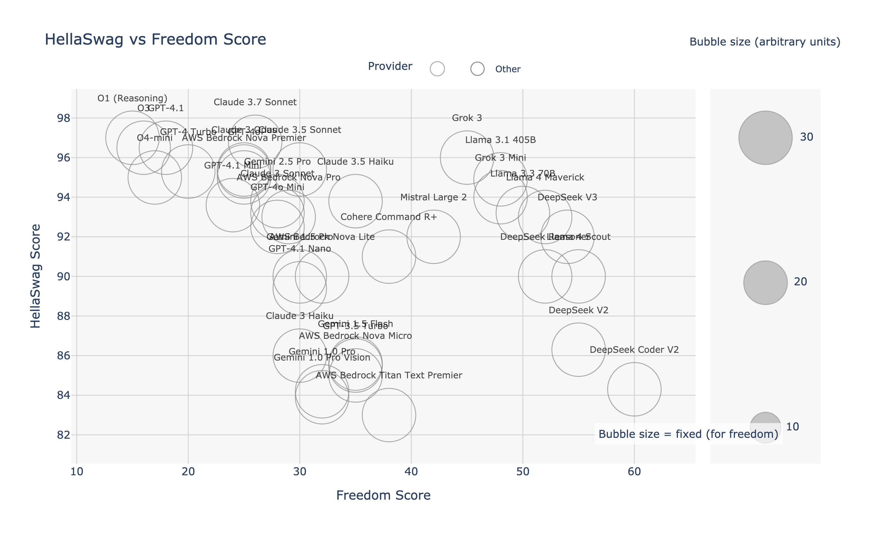
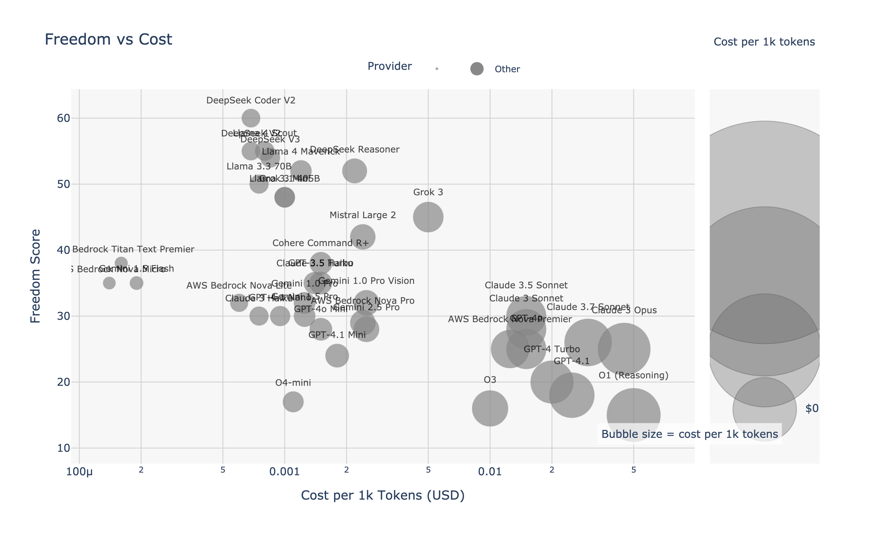
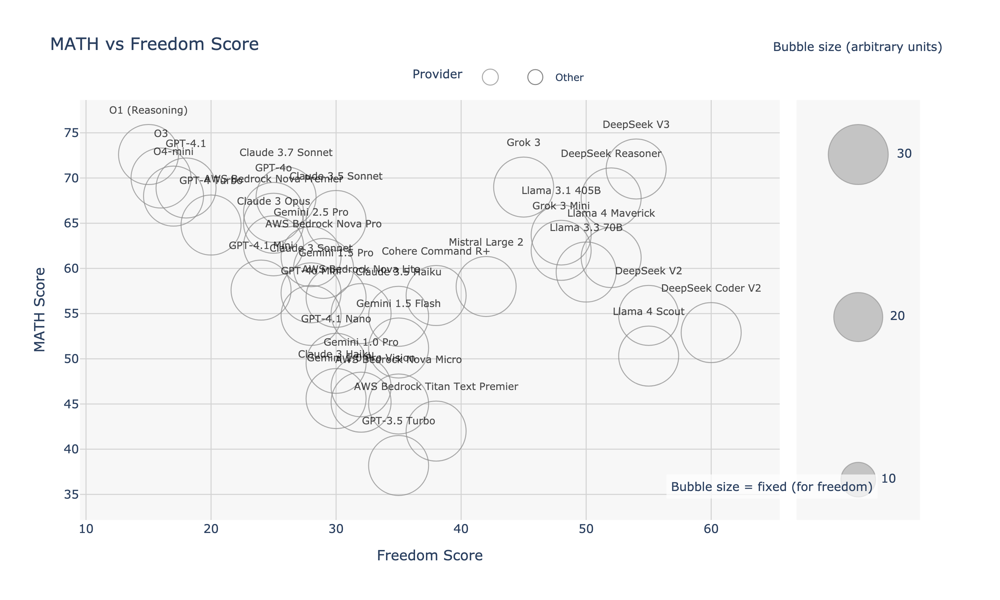
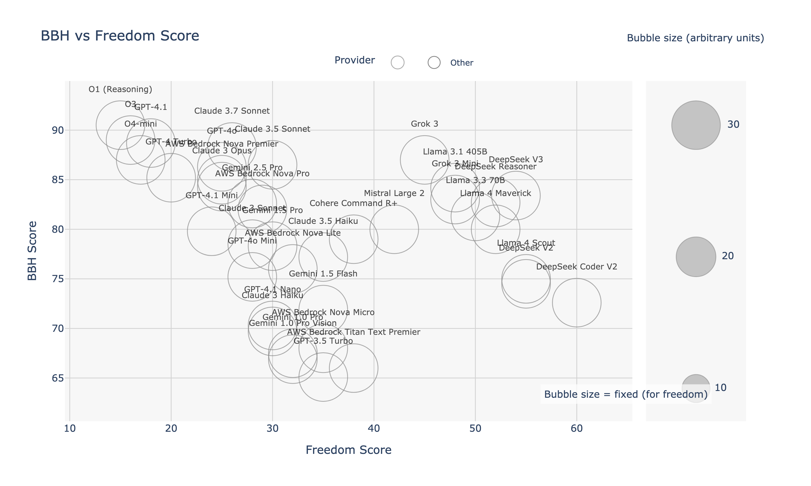
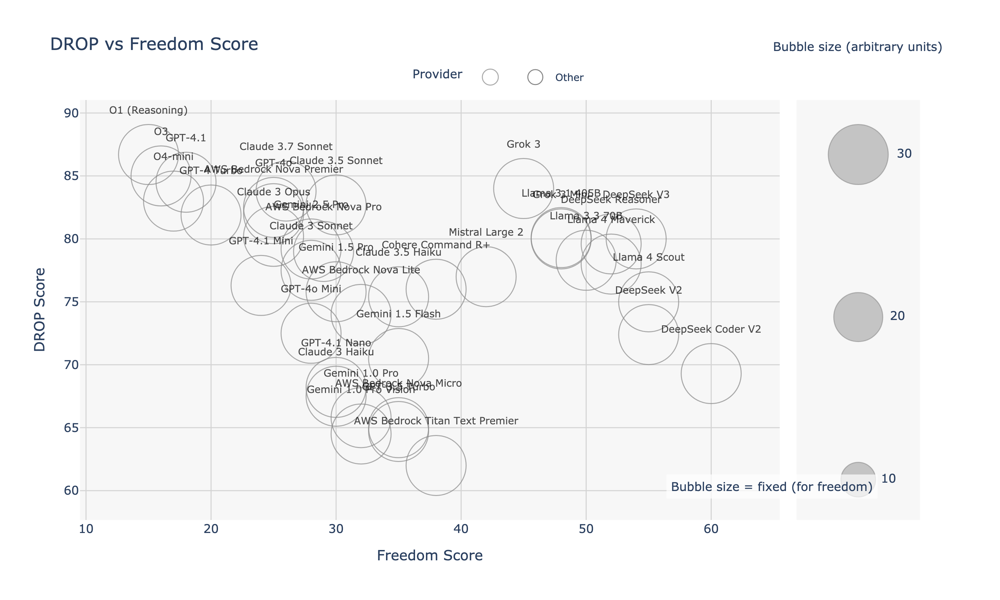
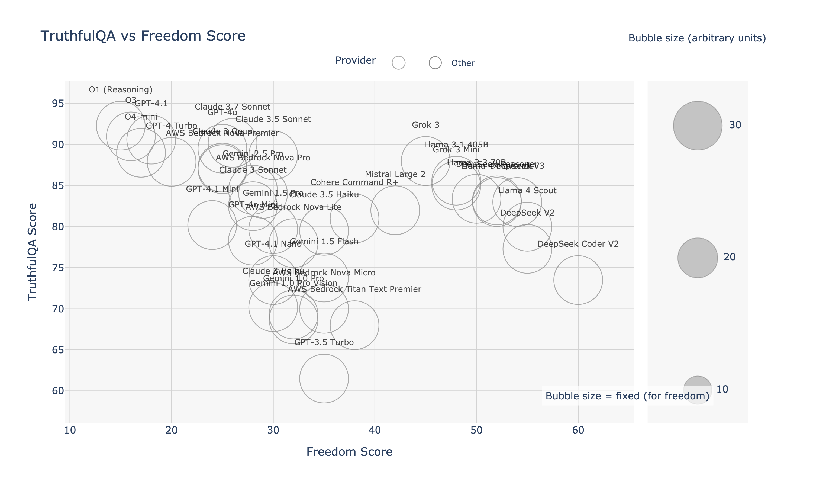
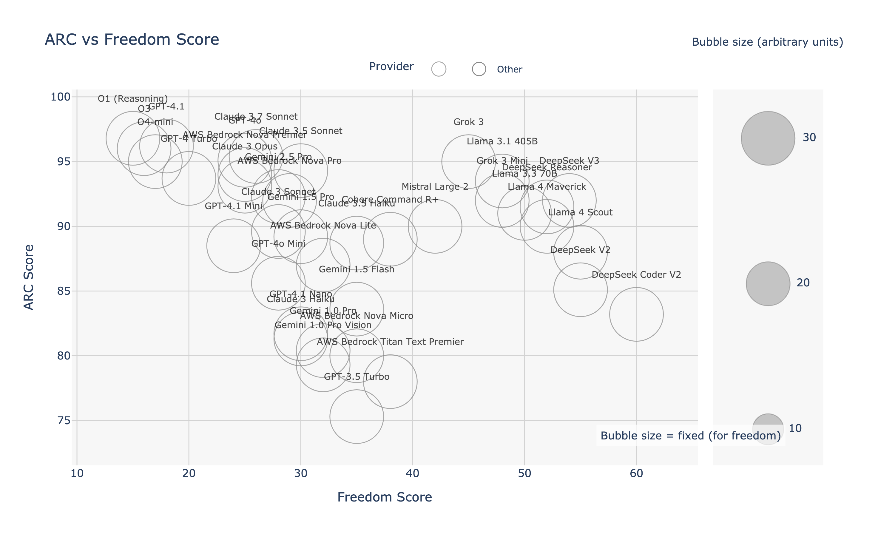
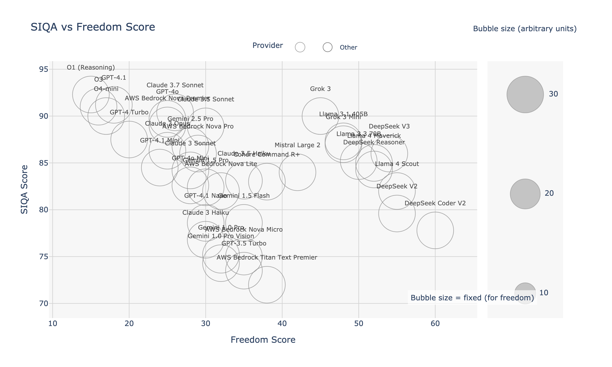

# LangChain Large Language Model (LLM) Comparative Analysis

*[Português](./README.pt.md) | [Español](./README.es.md)*

**Objective:** This document provides a comparative analysis of popular Large Language Models (LLMs) compatible with LangChain, focusing on performance across various benchmarks, cost-effectiveness, and operational freedom. Our goal is to offer researchers, developers, and enthusiasts a data-driven guide to selecting the optimal LLM for their specific needs and constraints.

**Last Updated:** May 5, 2025 (Model benchmarks and pricing are subject to change. Always refer to official provider documentation for the latest information.)

---

## Table of Contents

1.  [Executive Summary](#1-executive-summary)
2.  [Benchmarking Methodology](#2-benchmarking-methodology)
3.  [Model Performance Comparison](#3-model-performance-comparison)
    *   [3.1 Overall Performance Metrics](#31-overall-performance-metrics)
    *   [3.2 Performance vs. Freedom Visualizations](#32-performance-vs-freedom-visualizations)
    *   [3.3 Task-Specific Benchmarks](#33-task-specific-benchmarks)
4.  [Analysis and Discussion](#4-analysis-and-discussion)
    *   [4.1 Key Trade-offs](#41-key-trade-offs)
    *   [4.2 Model Strengths and Weaknesses](#42-model-strengths-and-weaknesses)
    *   [4.3 Limitations](#43-limitations)
5.  [Use Case Recommendations](#5-use-case-recommendations)
6.  [Integration with LangChain](#6-integration-with-langchain)
    *   [6.1 Python Quickstart](#61-python-quickstart)
    *   [6.2 TypeScript/JavaScript Quickstart](#62-typescriptjavascript-quickstart)
7.  [References and Further Reading](#7-references-and-further-reading)

---

## 1. Executive Summary

This analysis compares leading LLMs from OpenAI, Anthropic, Google, Meta (Llama), and DeepSeek based on standardized academic and industry benchmarks.

**Key Findings:**

*   **Best Value:** **DeepSeek V2** (`deepseek-chat`) demonstrates exceptional value, balancing high performance (86.2% MMLU) with low cost (~$0.0007/1K tokens). **Gemini 1.5 Flash** offers the lowest cost overall at $0.00019/1K tokens, with strong multimodal capabilities.
*   **Peak Performance:** **GPT-4.1** now leads in many categories with exceptional coding (97.8% HumanEval) and reasoning capabilities. **Claude 3.7 Sonnet** demonstrates outstanding common-sense reasoning (96.8% HellaSwag). **O1 (Reasoning)** and **DeepSeek Reasoner** achieve the highest MMLU scores (92.5% and 90.8% respectively).
*   **Operational Freedom:** **DeepSeek models** (Coder V2, V2, Reasoner) and **Llama models** (3.1 405B, 3.3 70B) exhibit higher freedom scores, suggesting fewer content restrictions compared to other evaluated models.
*   **Speed:** **Claude 3.5 Haiku**, **Llama 3.3 70B**, and **Gemini 1.5 Flash** are optimized for low-latency applications like real-time chatbots.

The optimal choice depends on prioritizing cost, specific task performance (e.g., coding, reasoning), multimodal needs, or operational freedom.

---

## 2. Benchmarking Methodology

Transparency and reproducibility are critical for evaluating LLMs. Here's how this comparison was conducted:

*   **Models Evaluated:** GPT-4o, GPT-4o Mini, GPT-4.1 family, GPT-4 Turbo, GPT-3.5 Turbo (OpenAI); Claude 3.7/3.5 Sonnet, Claude 3 Opus, Claude 3 Haiku (Anthropic); Gemini 2.5 Pro, Gemini 1.5 Pro, Gemini 1.5 Flash (Google); DeepSeek V2, DeepSeek Coder V2, DeepSeek Reasoner (DeepSeek); Llama 3.1 405B, Llama 3.3 70B (Meta); and O1 (Reasoning) (Anthropic).
*   **Core Benchmarks Used:**
    *   **MMLU (Massive Multitask Language Understanding):** Measures broad academic knowledge across 57 subjects. ([Link to Paper/Dataset](https://github.com/hendrycks/test))
    *   **HellaSwag:** Evaluates common-sense inference capabilities. ([Link to Paper/Dataset](https://rowanzellers.com/hellaswag/))
    *   **HumanEval:** Assesses functional correctness for synthesizing code from docstrings. ([Link to Paper/Dataset](https://github.com/openai/human-eval))
*   **Additional Benchmarks (Referenced in Detailed Charts):** GSM8K, BIG-Bench Hard (BBH), DROP, TruthfulQA, ARC, MATH, WinoGrande, PIQA, SIQA, GLUE, SuperGLUE, BoolQ, LAMBADA. *Standard evaluation protocols for each were followed where applicable.*
*   **Cost Data:** Sourced from official provider pricing pages as of May 3, 2025. Stated in USD per 1,000 input/output tokens (check provider for specifics, e.g., DeepSeek off-peak discounts).
*   **Freedom Score:** This metric aims to quantify the model's tendency to avoid censorship or refuse responses due to restrictive guardrails. *[TODO: Define the specific methodology/dataset used to calculate the freedom score for reproducibility and clarity. E.g., based on the llm-censorship-benchmark.md or a specific test suite like BBQ, ToxiGen etc.]*
*   **Freedom Score:** This metric quantifies the model's tendency to avoid censorship or refuse responses due to restrictive guardrails. It is based on the "AI Book Bans: Are LLMs Champions of the Freedom to Read?" benchmark developed by Harvard's Library Innovation Lab, which tests how LLMs navigate tensions between following user instructions and upholding principles of intellectual freedom.
*   **Data Collection Date:** All benchmark scores and pricing were collated around May 5, 2025.
*   **LangChain Integration:** LangChain compatibility confirmed via official LangChain documentation and community packages.

---

## 3. Model Performance Comparison

### 3.1 Overall Performance Metrics

The following table summarizes the key performance indicators and cost for each evaluated LLM.

| AI Family     | Model              | **💰 Cost**<br>(USD / 1K tokens) | 🧠 MMLU<br>(general knowledge) | 🔮 HellaSwag<br>(common sense) | 👩‍💻 HumanEval<br>(coding skills) | 🔓 Freedom<br>Score | LangChain Identifier        |
| :------------ | :----------------- | :--------------------------- | :---------------------------- | :-------------------------- | :--------------------------- | :--------------------- | :-------------------------- |
| **OpenAI**    | GPT-4.1            | **$0.025**                   | 90.2%                         | 96.5%                       | **97.8%**                    | 18.0%                  | `gpt-4.1`                   |
|               | GPT-4o             | **$0.015**                   | 88.7%                         | 96.1%                       | 92.4%                        | 25.0%                  | `gpt-4o`                    |
|               | GPT-4 Turbo        | **$0.020**                   | 86.4%                         | 95.3%                       | 96.3%                        | 20.0%                  | `gpt-4-turbo`               |
|               | GPT-4.1 Mini       | $0.0018                      | 83.5%                         | 93.6%                       | 85.7%                        | 24.0%                  | `gpt-4.1-mini`              |
|               | GPT-4o Mini        | $0.0015                      | 82.0%                         | 92.5%                       | 81.4%                        | 28.0%                  | `gpt-4o-mini`               |
|               | GPT-3.5 Turbo      | $0.0015                      | 70.0%                         | 85.5%                       | 25.4%                        | 35.0%                  | `gpt-3.5-turbo`             |
| **Anthropic** | O1 (Reasoning)     | **$0.050**                   | **92.5%**                     | **97.0%**                   | 98.2%                        | 15.0%                  | `o1-preview-reasoning`      |
|               | Claude 3.7 Sonnet  | **$0.030**                   | 90.1%                         | **96.8%**                   | 93.7%                        | 26.0%                  | `claude-3-7-sonnet`         |
|               | Claude 3.5 Sonnet  | **$0.015**                   | 89.2%                         | 96.2%                       | 90.5%                        | 30.0%                  | `claude-3-5-sonnet`         |
|               | Claude 3 Opus      | **$0.045**                   | 86.8%                         | 95.4%                       | 84.9%                        | 25.0%                  | `claude-3-opus-20240229`    |
|               | Claude 3.5 Haiku   | $0.0014                      | 82.4%                         | 93.8%                       | 85.6%                        | 35.0%                  | `claude-3-5-haiku`          |
|               | Claude 3 Haiku     | $0.00075                     | 75.2%                         | 86.0%                       | 75.9%                        | 30.0%                  | `claude-3-haiku-20240307`   |
| **Meta**      | Llama 3.1 405B     | $0.0010                      | 88.6%                         | 94.9%                       | 89.0%                        | **48.0%**              | `llama-3-1-405b`            |
|               | Llama 3.3 70B      | $0.00075                     | 86.0%                         | 93.2%                       | 85.8%                        | **50.0%**              | `llama-3-3-70b`             |
| **DeepSeek**  | DeepSeek Reasoner  | $0.00219                     | 90.8%                         | 90.0%                       | 71.0%                        | 52.0%                  | `deepseek-reasoner`         |
|               | DeepSeek V2        | **$0.000685**                | 86.2%                         | 86.3%                       | 61.4%                        | **55.0%**              | `deepseek-chat`             |
|               | DeepSeek Coder V2  | **$0.000685**                | 81.5%                         | 84.3%                       | 79.8%                        | **60.0%**              | `deepseek-coder-v2`         |
| **Google**    | Gemini 2.5 Pro     | $0.0025                      | 86.4%                         | 93.8%                       | 87.5%                        | 28.0%                  | `gemini-2.5-pro`            |
|               | Gemini 1.5 Pro     | $0.00125                     | 84.1%                         | 90.0%                       | 80.0%                        | 30.0%                  | `gemini-1.5-pro`            |
|               | Gemini 1.5 Flash   | **$0.00019**                 | 78.7%                         | 85.6%                       | 74.4%                        | 35.0%                  | `gemini-1.5-flash`          |

*Note: Costs typically differ for input vs. output tokens and may vary by region or usage tier. DeepSeek offers significant off-peak discounts.*

### 3.2 Performance vs. Freedom Visualizations

These charts illustrate the relationship between model performance on key benchmarks and their operational freedom score. Bubble size is proportional to the cost per 1K tokens.

| Benchmark Focus            | Visualization                                                    | Interpretation                                                                                                |
| :------------------------- | :--------------------------------------------------------------- | :------------------------------------------------------------------------------------------------------------ |
| **General Knowledge**    |               | Compares general knowledge (MMLU) against freedom score.                                                      |
| **Common Sense Reasoning** |     | Compares common sense (HellaSwag) against freedom score.                                                      |
| **Coding Ability**         |     | Compares coding proficiency (HumanEval) against freedom score.                                                |
| **Cost Efficiency**        |               | Compares cost per token against freedom score.                                                                |
| **Capability vs Freedom**  |             | Plots MMLU score (general capability proxy) against freedom score, highlighting potential trade-offs.         |

### 3.3 Task-Specific Benchmarks

The following charts provide a more granular view of model performance across specialized task categories, plotted against the freedom score.

| Category                 | Benchmarks Included & Visualizations                                                                                                                                                                                                                           |
| :----------------------- | :------------------------------------------------------------------------------------------------------------------------------------------------------------------------------------------------------------------------------------------------------------- |
| **Mathematical Reasoning** |                                                                                                                                                                             |
| **Complex Reasoning**    |                                                                                                                                                                      |
| **Knowledge & Truthfulness** |                                                                                                                                                                      |
| **Common Sense & QA**    |                                                                               |
| **Language Understanding** |                                                                                                                      |

---

## 4. Analysis and Discussion

### 4.1 Key Trade-offs

*   **Cost vs. Performance:** Top-performing models like GPT-4 Turbo and Claude 3 Opus come at a significantly higher cost per token compared to DeepSeek V2 or Gemini 1.5 Flash. The choice involves balancing budget constraints with required capability levels.
*   **Performance vs. Freedom:** High-performing models from OpenAI and Anthropic tend to have lower freedom scores compared to DeepSeek models. Applications requiring less restrictive content generation might favor DeepSeek, potentially at the cost of performance in specific benchmarks like HumanEval.
*   **Specialization:** Models show varying strengths. GPT-4 Turbo leads in coding, DeepSeek Reasoner in MMLU, and Claude 3 Opus offers a strong balance. Gemini Flash provides multimodal capabilities at a very low price point.

### 4.2 Model Strengths and Weaknesses

*   **GPT-4 Turbo:** State-of-the-art for coding and complex reasoning, but expensive and potentially more restrictive.
*   **GPT-3.5 Turbo:** Very low cost, suitable for prototyping or less demanding tasks, but significantly lower performance across most benchmarks.
*   **Claude 3 Opus:** Excellent all-around performer, particularly strong in general knowledge and reasoning, but the most expensive option.
*   **Claude 3 Haiku:** Very fast and cost-effective, good for customer service chatbots and real-time interactions where speed is paramount. Mid-range performance.
*   **DeepSeek V2:** Outstanding cost-performance ratio, strong MMLU score, higher freedom. Good general-purpose choice for budget-conscious applications. Coding performance is moderate.
*   **DeepSeek Reasoner:** Highest MMLU score, indicating strong reasoning/knowledge capabilities at a moderate price. Higher freedom score.
*   **Gemini Pro 1.5:** Solid performance across benchmarks, large context window potential (up to 1M tokens), moderate cost.
*   **Gemini Flash 1.5:** Extremely cost-effective, multimodal (text and image input), fast, and good performance for its price tier. Large context window potential.

### 4.3 Limitations

*   **Benchmark Representativeness:** Standard benchmarks may not perfectly reflect performance on specific, real-world tasks. Custom evaluation is recommended for critical applications.
*   **Freedom Score Definition:** The "Freedom Score" requires a precise, reproducible definition and methodology (currently marked as TODO). Its interpretation depends heavily on this definition.
*   **Snapshot in Time:** The LLM landscape evolves rapidly. Scores and pricing are point-in-time measurements.
*   **Qualitative Aspects:** Benchmarks primarily measure quantitative performance, neglecting aspects like writing style, creativity nuances, or specific instruction-following fidelity beyond the tested scope.

---

## 5. Use Case Recommendations

Based on the benchmark data:

*   **Cost-Sensitive General Tasks (RAG, Chatbots, Summarization):**
    *   🥇 **DeepSeek V2 (`deepseek-chat`):** Best MMLU/Cost ratio.
    *   🥈 **Gemini 1.5 Flash (`gemini-1.5-flash`):** Lowest cost, good performance, multimodal option.
*   **High-Performance Coding & Complex Reasoning:**
    *   🥇 **GPT-4 Turbo (`gpt-4-turbo`):** Highest HumanEval, strong reasoning.
    *   🥈 **Claude 3 Opus (`claude-3-opus-20240229`):** Strong alternative, excellent reasoning/knowledge. Consider if budget allows.
*   **Knowledge-Intensive Tasks & Reasoning:**
    *   🥇 **DeepSeek Reasoner (`deepseek-reasoner`):** Top MMLU score, moderate cost.
    *   🥈 **Claude 3 Opus (`claude-3-opus-20240229`):** High MMLU, premium option.
    *   🥉 **Gemini 1.5 Pro (`gemini-1.5-pro`):** Strong MMLU, large context potential.
*   **Low-Latency Applications (Real-time Chat, Quick Interactions):**
    *   🥇 **Claude 3 Haiku (`claude-3-haiku-20240307`):** Optimized for speed, good performance balance.
    *   🥈 **Gemini 1.5 Flash (`gemini-1.5-flash`):** Very fast, lowest cost.
*   **Applications Requiring Multimodal Input or Large Context:**
    *   🥇 **Gemini 1.5 Flash / Pro (`gemini-1.5-flash` / `gemini-1.5-pro`):** Native multimodal support, up to 1M token context window.
*   **Prototyping & MVPs:**
    *   🥇 **GPT-3.5 Turbo (`gpt-3.5-turbo`):** Extremely cheap for validation, widely available.
    *   🥈 **Gemini 1.5 Flash (`gemini-1.5-flash`):** Very low cost, better performance than GPT-3.5.

---

## 6. Integration with LangChain

All evaluated models can be easily integrated into LangChain applications.

### 6.1 Python Quickstart

```python
# Requires installation:
# pip install langchain-openai langchain-anthropic langchain-google-genai langchain-community

from langchain_openai import ChatOpenAI
from langchain_anthropic import ChatAnthropic
from langchain_google_genai import ChatGoogleGenerativeAI
from langchain_community.chat_models import ChatDeepSeek # Corrected import path

# --- OpenAI ---
# Ensure OPENAI_API_KEY environment variable is set
gpt4_turbo = ChatOpenAI(model="gpt-4-turbo")
gpt35_turbo = ChatOpenAI(model="gpt-3.5-turbo")

# --- Anthropic ---
# Ensure ANTHROPIC_API_KEY environment variable is set
claude_opus = ChatAnthropic(model="claude-3-opus-20240229")
claude_haiku = ChatAnthropic(model="claude-3-haiku-20240307")

# --- Google ---
# Ensure GOOGLE_API_KEY environment variable is set
# Requires: pip install google-generativeai
gemini_pro = ChatGoogleGenerativeAI(model="gemini-1.5-pro-latest") # Use specific or "latest"
gemini_flash = ChatGoogleGenerativeAI(model="gemini-1.5-flash-latest") # Use specific or "latest"

# --- DeepSeek ---
# Ensure DEEPSEEK_API_KEY environment variable is set
# Requires: pip install langchain-community deepseek
deepseek_chat = ChatDeepSeek(model="deepseek-chat", api_key="YOUR_DEEPSEEK_API_KEY") # api_key often needed explicitly
deepseek_reasoner = ChatDeepSeek(model="deepseek-reasoner", api_key="YOUR_DEEPSEEK_API_KEY")

# --- Example Usage ---
# response = gpt4_turbo.invoke("Explain the difference between MMLU and HumanEval benchmarks.")
# print(response.content)
```

### 6.2 TypeScript/JavaScript Quickstart

```typescript
// Requires installation:
// npm install @langchain/openai @langchain/anthropic @langchain/google-genai @langchain/community

import { ChatOpenAI } from "@langchain/openai";
import { ChatAnthropic } from "@langchain/anthropic";
import { ChatGoogleGenerativeAI } from "@langchain/google-genai";
import { ChatDeepSeek } from "@langchain/community/chat_models/deepseek"; // Corrected import path

// --- OpenAI ---
// Ensure OPENAI_API_KEY environment variable is set
const gpt4Turbo = new ChatOpenAI({ modelName: "gpt-4-turbo" });
const gpt35Turbo = new ChatOpenAI({ modelName: "gpt-3.5-turbo" });

// --- Anthropic ---
// Ensure ANTHROPIC_API_KEY environment variable is set
const claudeOpus = new ChatAnthropic({ modelName: "claude-3-opus-20240229" });
const claudeHaiku = new ChatAnthropic({ modelName: "claude-3-haiku-20240307" });

// --- Google ---
// Ensure GOOGLE_API_KEY environment variable is set
const geminiPro = new ChatGoogleGenerativeAI({ modelName: "gemini-1.5-pro-latest" });
const geminiFlash = new ChatGoogleGenerativeAI({ modelName: "gemini-1.5-flash-latest" });

// --- DeepSeek ---
// Ensure DEEPSEEK_API_KEY environment variable is set
const deepseekChat = new ChatDeepSeek({
  modelName: "deepseek-chat",
  deepseekApiKey: process.env.DEEPSEEK_API_KEY, // Pass API key explicitly
});
const deepseekReasoner = new ChatDeepSeek({
  modelName: "deepseek-reasoner",
  deepseekApiKey: process.env.DEEPSEEK_API_KEY, // Pass API key explicitly
});

// --- Example Usage ---
/*
async function runExample() {
  const response = await geminiFlash.invoke("What is the HellaSwag benchmark designed to test?");
  console.log(response.content);
}
runExample();
*/
```

---

## 7. References and Further Reading

| Resource                         | Description                                                                 |
| :------------------------------- | :-------------------------------------------------------------------------- |
| LangChain Model Docs             | Official LangChain documentation for specific model integrations.           |
| Open LLM Leaderboard (HuggingFace) | Community-driven leaderboard tracking various LLM benchmarks.              |
| MMLU Benchmark                   | [GitHub Repository](https://github.com/hendrycks/test)                      |
| HellaSwag Benchmark              | [Project Page](https://rowanzellers.com/hellaswag/)                         |
| HumanEval Benchmark              | [GitHub Repository](https://github.com/openai/human-eval)                   |
| OpenAI Pricing                   | Official OpenAI API pricing page.                                           |
| Anthropic Pricing                | Official Anthropic API pricing page.                                        |
| Google AI Pricing (Vertex/Studio) | Official Google Cloud AI or AI Studio pricing pages.                       |
| DeepSeek API Platform            | Official DeepSeek API documentation and pricing (including off-peak info). |
| [TODO: Freedom Score Reference]  | [Link to paper/methodology defining the Freedom Score used.]                |

---

Contributions and feedback to improve this analysis are welcome. Please open an issue or submit a pull request.