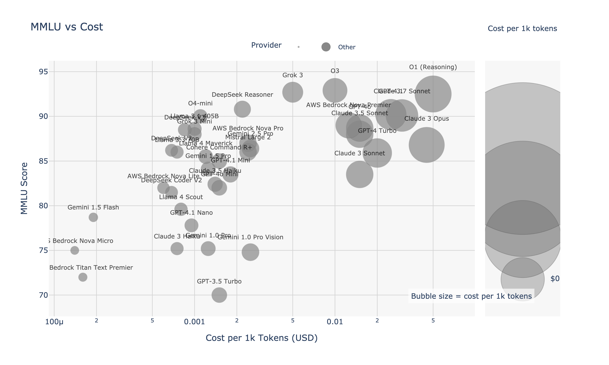
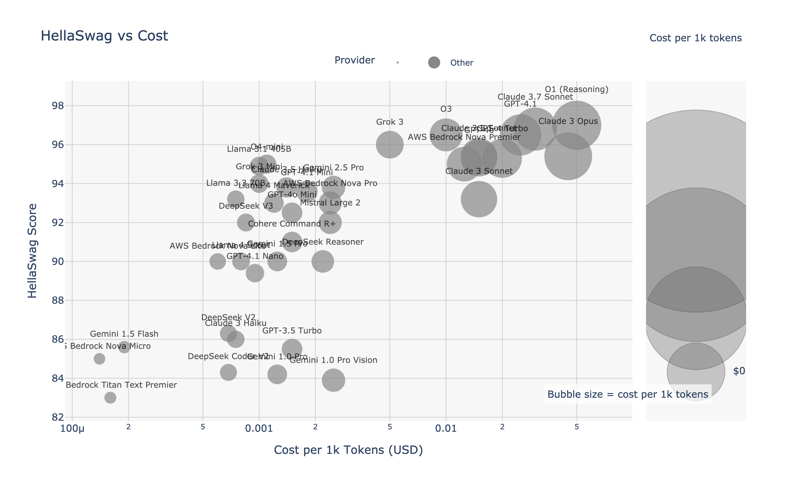
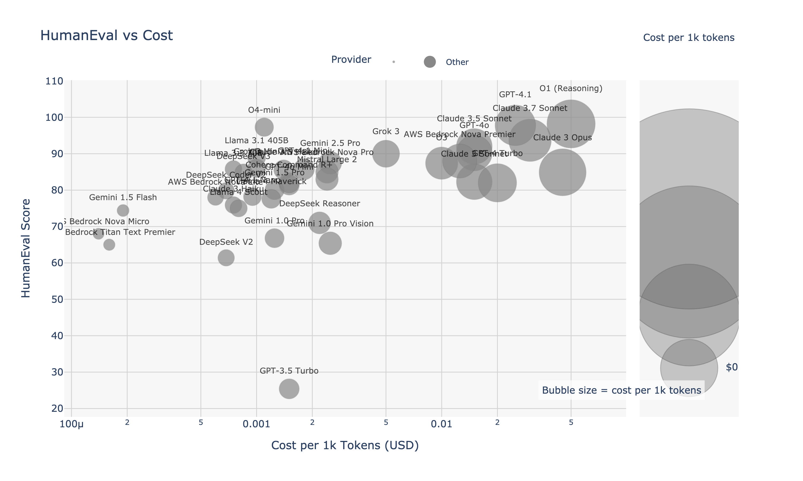

# LangChain LLM Comparison Guide

*[Português](./README.pt.md) | [Español](./README.es.md)*

This guide helps LangChain ecosystem developers choose the most suitable language model (LLM) for their projects, based on cost, performance, and specific capabilities.

## Executive Summary

This guide compares LangChain-compatible models from OpenAI, Anthropic, Google, and DeepSeek. Key highlights:

- **DeepSeek V3** offers the best cost-quality ratio (~$0.07 USD/million tokens with ~88% MMLU)
- **GPT-4 Turbo** and **Claude 3 Opus** lead in absolute accuracy on HellaSwag (~95%) and HumanEval code generation (~96%)
- **Gemini Flash 1.5** is the most economical multimodal option with 1M token context and low latency

Choose your model based on your specific LangChain project requirements.

---

## 1. Models, costs and key benchmarks

| Platform | Model | **Cost**<br>(USD / 1K tokens, avg in+out) | MMLU<br>(5-shot, %) | HellaSwag<br>(10-shot, %) | HumanEval<br>(pass@1, %) | LangChain Name |
|---------|-------|----------------------|-------|---------|-----------|----------------|
| **OpenAI** | GPT-4 Turbo | **0.020** | 86.4 | **95.3** | **96.3** | `gpt-4-turbo` |
|  | GPT-3.5 Turbo | 0.0015 | 70.0 | 85.5 | 25.4 | `gpt-3.5-turbo` |
| **Anthropic** | Claude 3 Opus | **0.045** | 86.8 | 95.4 | 84.9 | `claude-3-opus-20240229` |
|  | Claude 3 Haiku | 0.00075 | 75.2 | ~86 | 75.9 | `claude-3-haiku-20240307` |
| **DeepSeek** | DeepSeek V3 | **0.000685** | **88.5** | 88.9 | 65.2 | `deepseek-chat` |
|  | DeepSeek R1 | 0.00219 | 90.8 (MMLU-Redux) | 90 ±0.5 | 69 – 73 | `deepseek-reasoner` |
| **Google** | Gemini Flash 1.5 | **0.00019** | 78.7 | 85.6 | 74.4 | `gemini-1.5-flash` |
|  | Gemini Pro 2 | 0.00125 | 84.1 | ≈ 90* | ≈ 80* | `gemini-1.5-pro` |

> **Note:** Prices based on official rates for text-only usage (input + output averaged). DeepSeek prices shown are for **standard hours**; off-peak is 50% cheaper.

*Data collected and verified as of April 24, 2024.*

---

## 2. Visualization: Cost vs Quality

| Benchmark | Chart |
|-----------|-------|
| MMLU (general knowledge) |  |
| HellaSwag (contextual understanding) |  |
| HumanEval (code generation) |  |

*Charts generated on April 24, 2024, based on current benchmarks and pricing.*

---

## 3. Selection guide for LangChain use cases

### High-volume applications with limited budget
* **DeepSeek V3** (`deepseek-chat`) - ideal for:
  * RAG chains with document retrieval and synthesis
  * High-volume chatbots requiring good accuracy
  * Medium-complexity code and task automation
  * Usage in LangChain: `from langchain_community.chat_models import ChatDeepSeek`

* **Gemini Flash 1.5** (`gemini-1.5-flash`) - ideal for:
  * Economical multimodal processing (text + images)
  * Chains with very long documents (up to 1M tokens)
  * Usage in LangChain: `from langchain_google_genai import ChatGoogleGenerativeAI`

### Critical reasoning or coding applications
* **GPT-4 Turbo** (`gpt-4-turbo`) and **Claude 3 Opus** (`claude-3-opus`) - ideal for:
  * Autonomous agents requiring complex reasoning
  * Production-grade code generation
  * Legal, financial, or medical analysis with high degree of accuracy
  * Usage in LangChain: `from langchain_openai import ChatOpenAI` or `from langchain_anthropic import ChatAnthropic`

### Real-time chatbots and assistants
* **Claude 3 Haiku** (`claude-3-haiku`) and **Gemini Flash** (`gemini-1.5-flash`):
  * Near-instant responses (< 3-6s)
  * Good quality (above 75% MMLU)
  * Excellent for interactive conversational assistants
  * Easy implementation in LangChain conversational chains

### Rapid prototyping
* **GPT-3.5 Turbo** (`gpt-3.5-turbo`):
  * Perfect for MVPs and proof of concepts
  * Extremely economical for initial application validation
  * Acceptable quality (70% MMLU) for many use cases
  * Easy integration: `from langchain_openai import ChatOpenAI`

---

## 4. Implementation in LangChain

### Python
```python
# Example: Initializing different models in LangChain
from langchain_openai import ChatOpenAI
from langchain_anthropic import ChatAnthropic
from langchain_google_genai import ChatGoogleGenerativeAI
from langchain_community.chat_models import ChatDeepSeek

# OpenAI
gpt4_turbo = ChatOpenAI(model="gpt-4-turbo")
gpt35_turbo = ChatOpenAI(model="gpt-3.5-turbo")

# Anthropic
claude_opus = ChatAnthropic(model="claude-3-opus-20240229")
claude_haiku = ChatAnthropic(model="claude-3-haiku-20240307")

# Google
gemini_flash = ChatGoogleGenerativeAI(model="gemini-1.5-flash")
gemini_pro = ChatGoogleGenerativeAI(model="gemini-1.5-pro")

# DeepSeek
deepseek_chat = ChatDeepSeek(model="deepseek-chat")
deepseek_reasoner = ChatDeepSeek(model="deepseek-reasoner")
```

### TypeScript/JavaScript
```typescript
// Example: Initializing different models in LangChain.js
import { ChatOpenAI } from "@langchain/openai";
import { ChatAnthropic } from "@langchain/anthropic";
import { ChatGoogleGenerativeAI } from "@langchain/google-genai";
import { ChatDeepSeek } from "langchain/chat_models/deepseek";

// OpenAI
const gpt4Turbo = new ChatOpenAI({ modelName: "gpt-4-turbo" });
const gpt35Turbo = new ChatOpenAI({ modelName: "gpt-3.5-turbo" });

// Anthropic
const claudeOpus = new ChatAnthropic({ modelName: "claude-3-opus-20240229" });
const claudeHaiku = new ChatAnthropic({ modelName: "claude-3-haiku-20240307" });

// Google
const geminiFlash = new ChatGoogleGenerativeAI({ modelName: "gemini-1.5-flash" });
const geminiPro = new ChatGoogleGenerativeAI({ modelName: "gemini-1.5-pro" });

// DeepSeek
const deepseekChat = new ChatDeepSeek({ modelName: "deepseek-chat" });
const deepseekReasoner = new ChatDeepSeek({ modelName: "deepseek-reasoner" });
```

---

## 5. Resources for LangChain developers

| Resource | Utility |
|----------|------------------|
| **LangChain Model Provider Integrations** | Official documentation for LLM integrations with LangChain |
| **Open LLM Leaderboard** | Updated benchmarks for MMLU, HellaSwag, and ARC for +200 models |
| **DeepSeek API Docs** | Up-to-date pricing information and off-peak discounts |
| **Google AI Developers Forum** | Discussions about token pricing and latency for Gemini models |
| **Anthropic Claude API Reference** | Official documentation on context windows and parameters |

Providers update pricing and release new models frequently – DeepSeek and Google have announced possible price changes every quarter.

*Last updated: April 24, 2024*