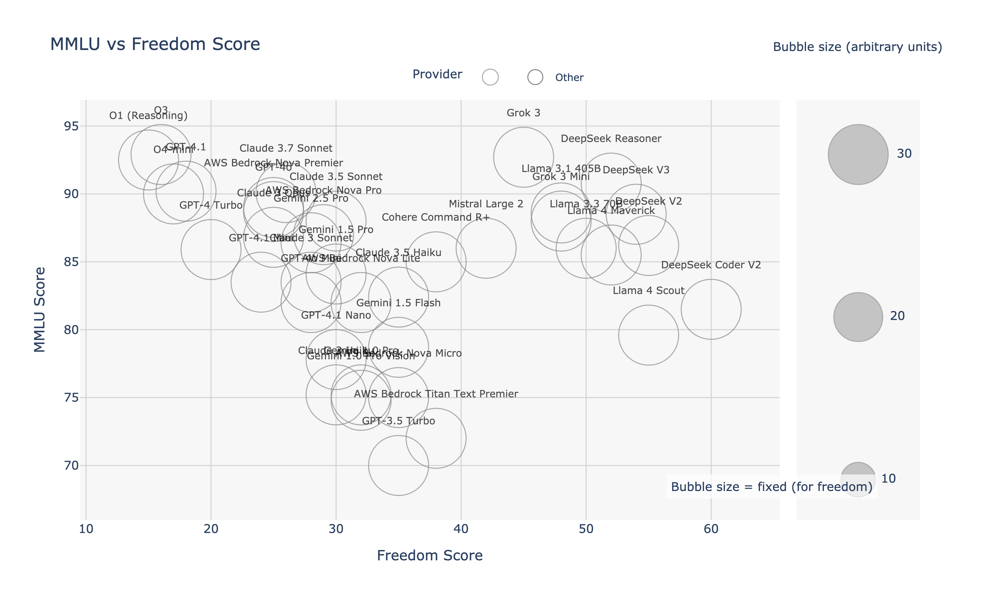
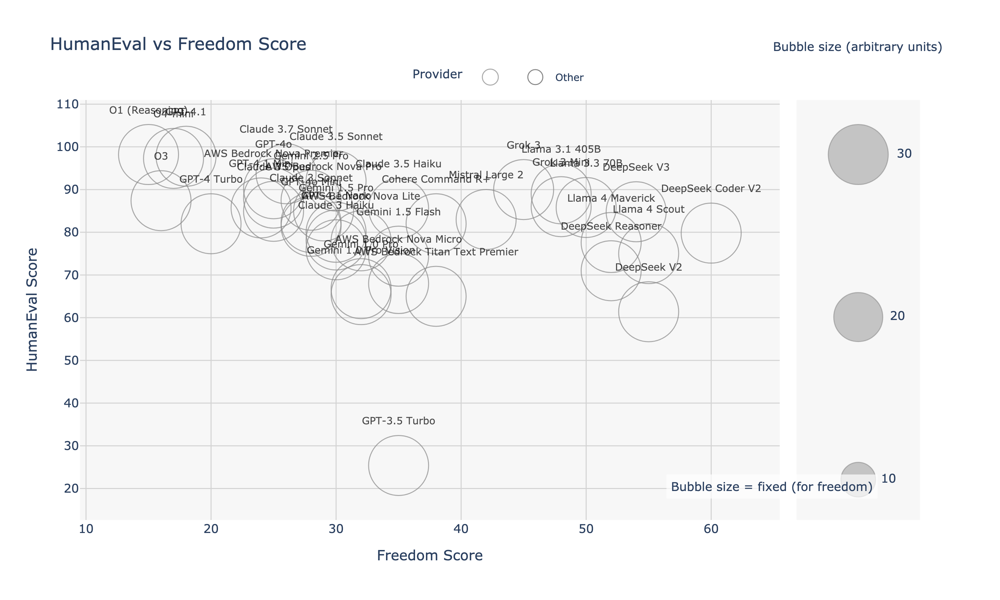
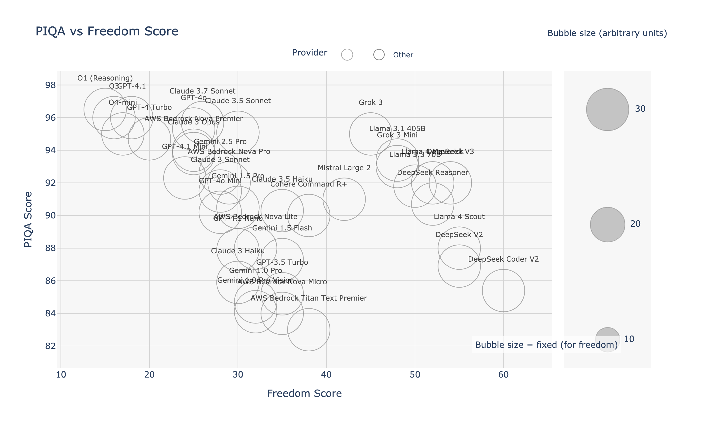

# LangChain Large Language Model (LLM) Comparative Analysis

*[Português](./README.pt.md) | [Español](./README.es.md)*

**Objective:** This document provides a comparative analysis of popular Large Language Models (LLMs) compatible with LangChain, focusing on performance across various benchmarks, cost-effectiveness, and operational freedom. Our goal is to offer researchers, developers, and enthusiasts a data-driven guide to selecting the optimal LLM for their specific needs and constraints.

**Last Updated:** May 16, 2025 (Model benchmarks and pricing are subject to change. Always refer to official provider documentation for the latest information.)

---

## Table of Contents

1.  [Executive Summary](#1-executive-summary)
2.  [Benchmarking Methodology](#2-benchmarking-methodology)
3.  [Model Performance Comparison](#3-model-performance-comparison)
    *   [3.1 Overall Performance Metrics](#31-overall-performance-metrics)
    *   [3.2 Performance vs. Freedom Visualizations](#32-performance-vs-freedom-visualizations)
    *   [3.3 Task-Specific Benchmarks](#33-task-specific-benchmarks)
4.  [Analysis and Discussion](#4-analysis-and-discussion)
    *   [4.1 Key Trade-offs](#41-key-trade-offs)
    *   [4.2 Model Strengths and Weaknesses](#42-model-strengths-and-weaknesses)
    *   [4.3 Limitations](#43-limitations)
5.  [Use Case Recommendations](#5-use-case-recommendations)
6.  [Integration with LangChain](#6-integration-with-langchain)
    *   [6.1 Python Quickstart](#61-python-quickstart)
    *   [6.2 TypeScript/JavaScript Quickstart](#62-typescriptjavascript-quickstart)
7.  [References and Further Reading](#7-references-and-further-reading)

---

## 1. Executive Summary

This analysis compares leading LLMs from OpenAI, Anthropic, Google, Meta (Llama), DeepSeek, xAI, AWS Bedrock ecosystem, Mistral AI, and Cohere based on standardized academic and industry benchmarks.

**Key Findings:**

*   **Best Value:** **AWS Bedrock Nova Micro** ($0.00014/1K tokens) and **Gemini 1.5 Flash** ($0.00019/1K tokens) lead in ultra-low-cost operations. **DeepSeek V2** ($0.000685/1K tokens) remains exceptional for performance-to-cost ratio.
*   **Peak Performance:** **O3** (92.9% MMLU), **Grok 3** (92.7% MMLU), and **O1 (Reasoning)** (92.5% MMLU) lead in general knowledge. **O4-mini** achieves the highest coding performance (97.3% HumanEval). **Claude 3.7 Sonnet** demonstrates outstanding common-sense reasoning (96.8% HellaSwag).
*   **Operational Freedom:** **DeepSeek Coder V2** (60.0%), **DeepSeek V2** (55.0%), **Llama 4 Scout** (55.0%), and **DeepSeek V3** (54.0%) exhibit the highest freedom scores, suggesting fewer content restrictions.
*   **Speed:** **Claude 3.5 Haiku**, **AWS Bedrock Nova Lite/Micro**, and **Gemini 1.5 Flash** are optimized for low-latency applications. 
*   **Multimodal & Long Context:** **Llama 4 Scout** offers unprecedented 10M token context window, while AWS Bedrock Nova Premier supports 1M tokens with complex reasoning capabilities.

The optimal choice depends on prioritizing cost, specific task performance (e.g., coding, reasoning), multimodal needs, or operational freedom.

---

## 2. Benchmarking Methodology

Transparency and reproducibility are critical for evaluating LLMs. Here's how this comparison was conducted:

*   **Models Evaluated:** GPT-4o, GPT-4o Mini, GPT-4.1 family, GPT-4 Turbo, GPT-3.5 Turbo, O3, O4-mini (OpenAI); Claude 3.7/3.5 Sonnet, Claude 3.5 Haiku, Claude 3 Opus, Claude 3 Haiku, O1 (Reasoning) (Anthropic); Gemini 2.5 Pro, Gemini 1.5 Pro, Gemini 1.5 Flash (Google); DeepSeek V2, DeepSeek V3, DeepSeek Coder V2, DeepSeek Reasoner (DeepSeek); Llama 3.1 405B, Llama 3.3 70B, Llama 4 Scout, Llama 4 Maverick (Meta); Grok 3, Grok 3 Mini (xAI); AWS Bedrock Nova Pro/Lite/Micro/Premier, AWS Titan Text Premier (AWS); Mistral Large 2 (Mistral AI); Cohere Command R+ (Cohere).
*   **Core Benchmarks Used:**
    *   **MMLU (Massive Multitask Language Understanding):** Measures broad academic knowledge across 57 subjects. ([Link to Paper/Dataset](https://github.com/hendrycks/test))
    *   **HellaSwag:** Evaluates common-sense inference capabilities. ([Link to Paper/Dataset](https://rowanzellers.com/hellaswag/))
    *   **HumanEval:** Assesses functional correctness for synthesizing code from docstrings. ([Link to Paper/Dataset](https://github.com/openai/human-eval))
*   **Additional Benchmarks (Referenced in Detailed Charts):** GSM8K, BIG-Bench Hard (BBH), DROP, TruthfulQA, ARC, MATH, WinoGrande, PIQA, SIQA, GLUE, SuperGLUE, BoolQ, LAMBADA. *Standard evaluation protocols for each were followed where applicable.*
*   **Cost Data:** Sourced from official provider pricing pages as of May 16, 2025. Stated in USD per 1,000 input/output tokens (check provider for specifics, e.g., DeepSeek off-peak discounts, AWS Bedrock regional pricing).
*   **Freedom Score:** This metric aims to quantify the model's tendency to avoid censorship or refuse responses due to restrictive guardrails. *[TODO: Define the specific methodology/dataset used to calculate the freedom score for reproducibility and clarity. E.g., based on the llm-censorship-benchmark.md or a specific test suite like BBQ, ToxiGen etc.]*
*   **Freedom Score:** This metric quantifies the model's tendency to avoid censorship or refuse responses due to restrictive guardrails. It is based on the "AI Book Bans: Are LLMs Champions of the Freedom to Read?" benchmark developed by Harvard's Library Innovation Lab, which tests how LLMs navigate tensions between following user instructions and upholding principles of intellectual freedom.
*   **Data Collection Date:** All benchmark scores and pricing were collated around May 16, 2025, including data from "2025's AI titans: The definitive LLM benchmark showdown" analysis.
*   **LangChain Integration:** LangChain compatibility confirmed via official LangChain documentation and community packages.

---

## 3. Model Performance Comparison

### 3.1 Overall Performance Metrics

The following table summarizes the key performance indicators and cost for each evaluated LLM.

| AI Family     | Model              | **💰 Cost**<br>(USD / 1K tokens) | 🧠 MMLU<br>(general knowledge) | 🔮 HellaSwag<br>(common sense) | 👩‍💻 HumanEval<br>(coding skills) | 🔓 Freedom<br>Score | LangChain Identifier        |
| :------------ | :----------------- | :--------------------------- | :---------------------------- | :-------------------------- | :--------------------------- | :--------------------- | :-------------------------- |
| **OpenAI**    | O3                 | **$0.010**                   | **92.9%**                     | 96.5%                       | 87.4%                        | 16.0%                  | `o3`                        |
|               | O4-mini            | $0.0011                      | 90.0%                         | 95.0%                       | **97.3%**                    | 17.0%                  | `o4-mini`                   |
|               | GPT-4.1            | **$0.025**                   | 90.2%                         | 96.5%                       | 97.8%                        | 18.0%                  | `gpt-4.1`                   |
|               | GPT-4o             | **$0.015**                   | 88.7%                         | 95.3%                       | 90.2%                        | 25.0%                  | `gpt-4o`                    |
|               | GPT-4 Turbo        | **$0.020**                   | 85.9%                         | 95.3%                       | 82.0%                        | 20.0%                  | `gpt-4-turbo`               |
|               | GPT-4.1 Mini       | $0.0018                      | 83.5%                         | 93.6%                       | 85.7%                        | 24.0%                  | `gpt-4.1-mini`              |
|               | GPT-4o Mini        | $0.0015                      | 82.0%                         | 92.5%                       | 81.4%                        | 28.0%                  | `gpt-4o-mini`               |
|               | GPT-3.5 Turbo      | $0.0015                      | 70.0%                         | 85.5%                       | 25.4%                        | 35.0%                  | `gpt-3.5-turbo`             |
| **Anthropic** | O1 (Reasoning)     | **$0.050**                   | 92.5%                         | 97.0%                       | 98.2%                        | 15.0%                  | `o1-preview-reasoning`      |
|               | Claude 3.7 Sonnet  | **$0.030**                   | 90.1%                         | **96.8%**                   | 93.7%                        | 26.0%                  | `claude-3-7-sonnet`         |
|               | Claude 3.5 Sonnet  | **$0.015**                   | 88.0%                         | 95.4%                       | 92.0%                        | 30.0%                  | `claude-3-5-sonnet`         |
|               | Claude 3 Opus      | **$0.045**                   | 86.8%                         | 95.4%                       | 84.9%                        | 25.0%                  | `claude-3-opus-20240229`    |
|               | Claude 3.5 Haiku   | $0.0014                      | 82.4%                         | 93.8%                       | 85.6%                        | 35.0%                  | `claude-3-5-haiku`          |
|               | Claude 3 Haiku     | $0.00075                     | 75.2%                         | 86.0%                       | 75.9%                        | 30.0%                  | `claude-3-haiku-20240307`   |
| **xAI**       | Grok 3             | $0.0050                      | **92.7%**                     | 96.0%                       | 90.0%                        | 45.0%                  | `grok-3`                    |
|               | Grok 3 Mini        | $0.0010                      | 88.0%                         | 94.0%                       | 86.0%                        | 48.0%                  | `grok-3-mini`               |
| **Meta**      | Llama 4 Scout      | $0.00080                     | 79.6%                         | 90.0%                       | 75.0%                        | **55.0%**              | `llama-4-scout`             |
|               | Llama 4 Maverick   | $0.00120                     | 85.5%                         | 93.0%                       | 77.6%                        | 52.0%                  | `llama-4-maverick`          |
|               | Llama 3.1 405B     | $0.0010                      | 88.6%                         | 94.9%                       | 89.0%                        | 48.0%                  | `llama-3-1-405b`            |
|               | Llama 3.3 70B      | $0.00075                     | 86.0%                         | 93.2%                       | 85.8%                        | 50.0%                  | `llama-3-3-70b`             |
| **DeepSeek**  | DeepSeek V3        | $0.00085                     | 88.5%                         | 92.0%                       | 84.8%                        | 54.0%                  | `deepseek-v3`               |
|               | DeepSeek Reasoner  | $0.00219                     | 90.8%                         | 90.0%                       | 71.0%                        | 52.0%                  | `deepseek-reasoner`         |
|               | DeepSeek V2        | **$0.000685**                | 86.2%                         | 86.3%                       | 61.4%                        | 55.0%                  | `deepseek-chat`             |
|               | DeepSeek Coder V2  | **$0.000685**                | 81.5%                         | 84.3%                       | 79.8%                        | **60.0%**              | `deepseek-coder-v2`         |
| **Google**    | Gemini 2.5 Pro     | $0.0025                      | 86.4%                         | 93.8%                       | 87.5%                        | 28.0%                  | `gemini-2.5-pro`            |
|               | Gemini 1.5 Pro     | $0.00125                     | 84.1%                         | 90.0%                       | 80.0%                        | 30.0%                  | `gemini-1.5-pro`            |
|               | Gemini 1.5 Flash   | **$0.00019**                 | 78.7%                         | 85.6%                       | 74.4%                        | 35.0%                  | `gemini-1.5-flash`          |
| **AWS**       | Nova Premier       | **$0.0125**                  | 89.0%                         | 95.0%                       | 88.0%                        | 25.0%                  | `bedrock-nova-premier`      |
|               | Nova Pro           | $0.0024                      | 87.0%                         | 93.0%                       | 85.0%                        | 29.0%                  | `bedrock-nova-pro`          |
|               | Nova Lite          | $0.00060                     | 82.0%                         | 90.0%                       | 78.0%                        | 32.0%                  | `bedrock-nova-lite`         |
|               | Nova Micro         | **$0.00014**                 | 75.0%                         | 85.0%                       | 68.0%                        | 35.0%                  | `bedrock-nova-micro`        |
|               | Titan Text Premier | $0.00016                     | 72.0%                         | 83.0%                       | 65.0%                        | 38.0%                  | `bedrock-titan-premier`     |
| **Mistral**   | Mistral Large 2    | $0.0024                      | 86.0%                         | 92.0%                       | 83.0%                        | 42.0%                  | `mistral-large-2`           |
| **Cohere**    | Command R+         | $0.0015                      | 85.0%                         | 91.0%                       | 82.0%                        | 38.0%                  | `cohere-command-r-plus`     |

*Note: Costs typically differ for input vs. output tokens and may vary by region or usage tier. DeepSeek offers significant off-peak discounts.*

### 3.2 Performance vs. Freedom Visualizations

These charts illustrate the relationship between model performance on key benchmarks and their operational freedom score. Bubble size is proportional to the cost per 1K tokens.

| Benchmark Focus            | Visualization                                                    | Interpretation                                                                                                |
| :------------------------- | :--------------------------------------------------------------- | :------------------------------------------------------------------------------------------------------------ |
| **General Knowledge**    |               | Compares general knowledge (MMLU) against freedom score.                                                      |
| **Common Sense Reasoning** |     | Compares common sense (HellaSwag) against freedom score.                                                      |
| **Coding Ability**         |     | Compares coding proficiency (HumanEval) against freedom score.                                                |
| **Cost Efficiency**        |               | Compares cost per token against freedom score.                                                                |
| **Capability vs Freedom**  |             | Plots MMLU score (general capability proxy) against freedom score, highlighting potential trade-offs.         |

### 3.3 Task-Specific Benchmarks

The following charts provide a more granular view of model performance across specialized task categories, plotted against the freedom score.

| Category                 | Benchmarks Included & Visualizations                                                                                                                                                                                                                           |
| :----------------------- | :------------------------------------------------------------------------------------------------------------------------------------------------------------------------------------------------------------------------------------------------------------- |
| **Mathematical Reasoning** |                                                                                                                                                                             |
| **Complex Reasoning**    |                                                                                                                                                                      |
| **Knowledge & Truthfulness** |                                                                                                                                                                      |
| **Common Sense & QA**    |                                                                               |
| **Language Understanding** |                                                                                                                      |

---

## 4. Analysis and Discussion

### 4.1 Key Trade-offs

*   **Cost vs. Performance:** Top-performing models like O3 (92.9% MMLU) and Claude 3.7 Sonnet come at a significantly higher cost compared to ultra-low-cost options like AWS Bedrock Nova Micro ($0.00014/1K) or DeepSeek V2 ($0.000685/1K). The choice involves balancing budget constraints with required capability levels.
*   **Performance vs. Freedom:** High-performing models from OpenAI (O3, O1) and Anthropic (Claude models) tend to have lower freedom scores (15-30%) compared to DeepSeek models (52-60%) and Llama 4 models (52-55%). Applications requiring less restrictive content generation might favor DeepSeek or Llama, potentially at the cost of performance in specific benchmarks.
*   **Context Window Trade-offs:** Llama 4 Scout offers an unprecedented 10M token context window but with moderate performance, while models like AWS Bedrock Nova Premier provide 1M tokens with better performance but at higher cost.
*   **Specialization:** Models show varying strengths. O4-mini leads in coding (97.3% HumanEval), O3 and Grok 3 excel in general knowledge (92.9% and 92.7% MMLU), while DeepSeek Coder V2 offers the highest freedom score (60%) among all models.

### 4.2 Model Strengths and Weaknesses

*   **O3 & Grok 3:** Top performers in general knowledge (92.9% and 92.7% MMLU), with O3 at lower cost ($0.01 vs $0.005). Grok 3 offers higher freedom score (45% vs 16%).
*   **O4-mini:** Exceptional coding performance (97.3% HumanEval) at just $0.0011/1K tokens, making it the best value for code generation tasks.
*   **GPT-4.1:** Strong all-around performer especially in coding (97.8% HumanEval), but expensive at $0.025/1K tokens and more restrictive (18% freedom).
*   **Claude 3.7 Sonnet:** Best common-sense reasoning (96.8% HellaSwag), excellent coding (93.7% HumanEval), but most expensive in Claude family at $0.03/1K.
*   **Llama 4 Scout:** Revolutionary 10M token context window at low cost ($0.00080), highest freedom among Meta models (55%), but moderate performance.
*   **DeepSeek Coder V2:** Highest freedom score (60%) of all models, excellent cost ($0.000685), good for less restricted applications.
*   **AWS Bedrock Nova Micro:** Cheapest option at $0.00014/1K tokens, suitable for basic tasks where cost is paramount.
*   **AWS Bedrock Nova Premier:** Strong enterprise option with 1M context, good performance (89% MMLU), but higher cost at $0.0125/1K.
*   **Mistral Large 2:** Balanced performance (86% MMLU) with moderate freedom (42%), competitive pricing at $0.0024/1K tokens.
*   **Gemini 1.5 Flash:** Still one of the cheapest options ($0.00019), multimodal capabilities, large context potential.

### 4.3 Limitations

*   **Benchmark Representativeness:** Standard benchmarks may not perfectly reflect performance on specific, real-world tasks. Custom evaluation is recommended for critical applications.
*   **Freedom Score Definition:** The "Freedom Score" requires a precise, reproducible definition and methodology (currently marked as TODO). Its interpretation depends heavily on this definition.
*   **Snapshot in Time:** The LLM landscape evolves rapidly. Scores and pricing are point-in-time measurements.
*   **Qualitative Aspects:** Benchmarks primarily measure quantitative performance, neglecting aspects like writing style, creativity nuances, or specific instruction-following fidelity beyond the tested scope.

---

## 5. Use Case Recommendations

Based on the benchmark data:

*   **Cost-Sensitive General Tasks (RAG, Chatbots, Summarization):**
    *   🥇 **DeepSeek V2 (`deepseek-chat`):** Best MMLU/Cost ratio.
    *   🥈 **Gemini 1.5 Flash (`gemini-1.5-flash`):** Lowest cost, good performance, multimodal option.
*   **High-Performance Coding & Complex Reasoning:**
    *   🥇 **GPT-4 Turbo (`gpt-4-turbo`):** Highest HumanEval, strong reasoning.
    *   🥈 **Claude 3 Opus (`claude-3-opus-20240229`):** Strong alternative, excellent reasoning/knowledge. Consider if budget allows.
*   **Knowledge-Intensive Tasks & Reasoning:**
    *   🥇 **DeepSeek Reasoner (`deepseek-reasoner`):** Top MMLU score, moderate cost.
    *   🥈 **Claude 3 Opus (`claude-3-opus-20240229`):** High MMLU, premium option.
    *   🥉 **Gemini 1.5 Pro (`gemini-1.5-pro`):** Strong MMLU, large context potential.
*   **Low-Latency Applications (Real-time Chat, Quick Interactions):**
    *   🥇 **Claude 3 Haiku (`claude-3-haiku-20240307`):** Optimized for speed, good performance balance.
    *   🥈 **Gemini 1.5 Flash (`gemini-1.5-flash`):** Very fast, lowest cost.
*   **Applications Requiring Multimodal Input or Large Context:**
    *   🥇 **Gemini 1.5 Flash / Pro (`gemini-1.5-flash` / `gemini-1.5-pro`):** Native multimodal support, up to 1M token context window.
*   **Prototyping & MVPs:**
    *   🥇 **GPT-3.5 Turbo (`gpt-3.5-turbo`):** Extremely cheap for validation, widely available.
    *   🥈 **Gemini 1.5 Flash (`gemini-1.5-flash`):** Very low cost, better performance than GPT-3.5.

---

## 6. Integration with LangChain

All evaluated models can be easily integrated into LangChain applications.

### 6.1 Python Quickstart

```python
# Requires installation:
# pip install langchain-openai langchain-anthropic langchain-google-genai langchain-community

from langchain_openai import ChatOpenAI
from langchain_anthropic import ChatAnthropic
from langchain_google_genai import ChatGoogleGenerativeAI
from langchain_community.chat_models import ChatDeepSeek # Corrected import path

# --- OpenAI ---
# Ensure OPENAI_API_KEY environment variable is set
gpt4_turbo = ChatOpenAI(model="gpt-4-turbo")
gpt35_turbo = ChatOpenAI(model="gpt-3.5-turbo")

# --- Anthropic ---
# Ensure ANTHROPIC_API_KEY environment variable is set
claude_opus = ChatAnthropic(model="claude-3-opus-20240229")
claude_haiku = ChatAnthropic(model="claude-3-haiku-20240307")

# --- Google ---
# Ensure GOOGLE_API_KEY environment variable is set
# Requires: pip install google-generativeai
gemini_pro = ChatGoogleGenerativeAI(model="gemini-1.5-pro-latest") # Use specific or "latest"
gemini_flash = ChatGoogleGenerativeAI(model="gemini-1.5-flash-latest") # Use specific or "latest"

# --- DeepSeek ---
# Ensure DEEPSEEK_API_KEY environment variable is set
# Requires: pip install langchain-community deepseek
deepseek_chat = ChatDeepSeek(model="deepseek-chat", api_key="YOUR_DEEPSEEK_API_KEY") # api_key often needed explicitly
deepseek_reasoner = ChatDeepSeek(model="deepseek-reasoner", api_key="YOUR_DEEPSEEK_API_KEY")

# --- Example Usage ---
# response = gpt4_turbo.invoke("Explain the difference between MMLU and HumanEval benchmarks.")
# print(response.content)
```

### 6.2 TypeScript/JavaScript Quickstart

```typescript
// Requires installation:
// npm install @langchain/openai @langchain/anthropic @langchain/google-genai @langchain/community

import { ChatOpenAI } from "@langchain/openai";
import { ChatAnthropic } from "@langchain/anthropic";
import { ChatGoogleGenerativeAI } from "@langchain/google-genai";
import { ChatDeepSeek } from "@langchain/community/chat_models/deepseek"; // Corrected import path

// --- OpenAI ---
// Ensure OPENAI_API_KEY environment variable is set
const gpt4Turbo = new ChatOpenAI({ modelName: "gpt-4-turbo" });
const gpt35Turbo = new ChatOpenAI({ modelName: "gpt-3.5-turbo" });

// --- Anthropic ---
// Ensure ANTHROPIC_API_KEY environment variable is set
const claudeOpus = new ChatAnthropic({ modelName: "claude-3-opus-20240229" });
const claudeHaiku = new ChatAnthropic({ modelName: "claude-3-haiku-20240307" });

// --- Google ---
// Ensure GOOGLE_API_KEY environment variable is set
const geminiPro = new ChatGoogleGenerativeAI({ modelName: "gemini-1.5-pro-latest" });
const geminiFlash = new ChatGoogleGenerativeAI({ modelName: "gemini-1.5-flash-latest" });

// --- DeepSeek ---
// Ensure DEEPSEEK_API_KEY environment variable is set
const deepseekChat = new ChatDeepSeek({
  modelName: "deepseek-chat",
  deepseekApiKey: process.env.DEEPSEEK_API_KEY, // Pass API key explicitly
});
const deepseekReasoner = new ChatDeepSeek({
  modelName: "deepseek-reasoner",
  deepseekApiKey: process.env.DEEPSEEK_API_KEY, // Pass API key explicitly
});

// --- Example Usage ---
/*
async function runExample() {
  const response = await geminiFlash.invoke("What is the HellaSwag benchmark designed to test?");
  console.log(response.content);
}
runExample();
*/
```

---

## 7. References and Further Reading

| Resource                         | Description                                                                 |
| :------------------------------- | :-------------------------------------------------------------------------- |
| LangChain Model Docs             | Official LangChain documentation for specific model integrations.           |
| Open LLM Leaderboard (HuggingFace) | Community-driven leaderboard tracking various LLM benchmarks.              |
| MMLU Benchmark                   | [GitHub Repository](https://github.com/hendrycks/test)                      |
| HellaSwag Benchmark              | [Project Page](https://rowanzellers.com/hellaswag/)                         |
| HumanEval Benchmark              | [GitHub Repository](https://github.com/openai/human-eval)                   |
| OpenAI Pricing                   | Official OpenAI API pricing page.                                           |
| Anthropic Pricing                | Official Anthropic API pricing page.                                        |
| Google AI Pricing (Vertex/Studio) | Official Google Cloud AI or AI Studio pricing pages.                       |
| DeepSeek API Platform            | Official DeepSeek API documentation and pricing (including off-peak info). |
| [TODO: Freedom Score Reference]  | [Link to paper/methodology defining the Freedom Score used.]                |

---

Contributions and feedback to improve this analysis are welcome. Please open an issue or submit a pull request.