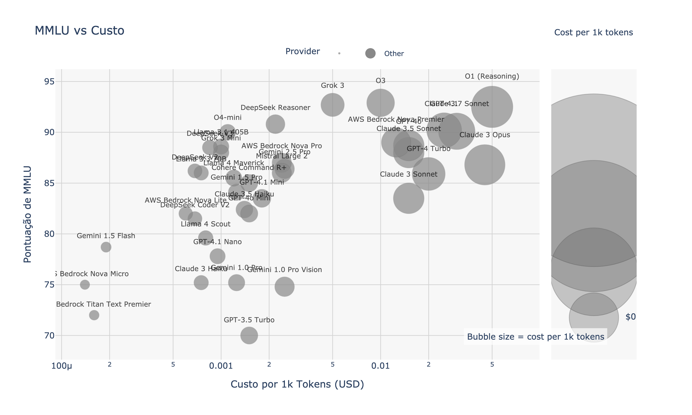
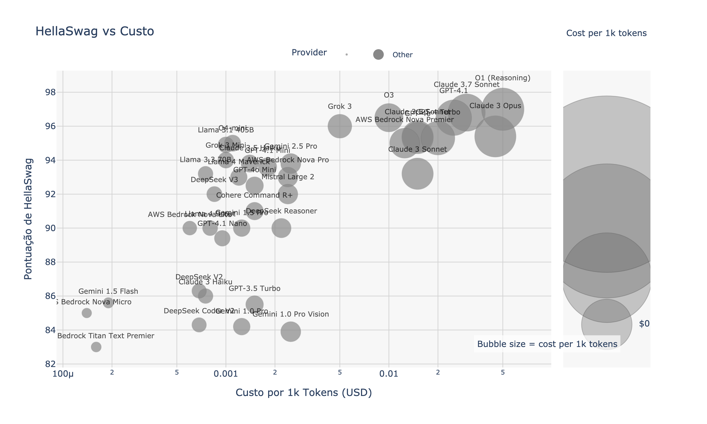
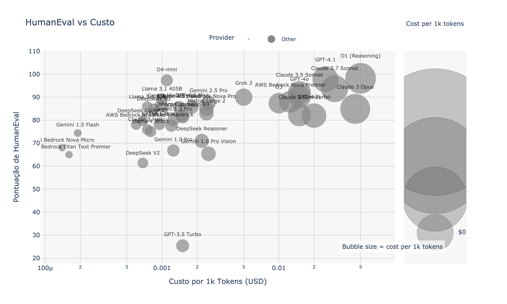

# Guia de Comparação de LLMs para LangChain

*[English](./README.md) | [Español](./README.es.md)*

Este guia ajuda desenvolvedores do ecossistema LangChain a escolher o modelo de linguagem (LLM) mais adequado para seus projetos, com base em custo, desempenho e capacidades específicas.

## Resumo Executivo

Este guia compara modelos compatíveis com LangChain da OpenAI, Anthropic, Google e DeepSeek. Destaques principais:

- **DeepSeek V3** oferece a melhor relação custo-qualidade (~$0,07 USD/milhão de tokens com ~88% MMLU)
- **GPT-4 Turbo** e **Claude 3 Opus** lideram em precisão absoluta no HellaSwag (~95%) e na geração de código HumanEval (~96%)
- **Gemini Flash 1.5** é a opção multimodal mais econômica com contexto de 1M tokens e baixa latência

Escolha seu modelo com base nos requisitos específicos do seu projeto LangChain.

---

## 1. Modelos, custos e benchmarks principais

| Plataforma | Modelo | **Custo**<br>(USD / 1K tokens, média entrada+saída) | MMLU<br>(5-shot, %) | HellaSwag<br>(10-shot, %) | HumanEval<br>(pass@1, %) | Nome no LangChain |
|---------|-------|----------------------|-------|---------|-----------|----------------|
| **OpenAI** | GPT-4 Turbo | **0,020** | 86,4 | **95,3** | **96,3** | `gpt-4-turbo` |
|  | GPT-3.5 Turbo | 0,0015 | 70,0 | 85,5 | 25,4 | `gpt-3.5-turbo` |
| **Anthropic** | Claude 3 Opus | **0,045** | 86,8 | 95,4 | 84,9 | `claude-3-opus-20240229` |
|  | Claude 3 Haiku | 0,00075 | 75,2 | ~86 | 75,9 | `claude-3-haiku-20240307` |
| **DeepSeek** | DeepSeek V3 | **0,000685** | **88,5** | 88,9 | 65,2 | `deepseek-chat` |
|  | DeepSeek R1 | 0,00219 | 90,8 (MMLU-Redux) | 90 ±0,5 | 69 – 73 | `deepseek-reasoner` |
| **Google** | Gemini Flash 1.5 | **0,00019** | 78,7 | 85,6 | 74,4 | `gemini-1.5-flash` |
|  | Gemini Pro 2 | 0,00125 | 84,1 | ≈ 90* | ≈ 80* | `gemini-1.5-pro` |

> **Nota:** Preços baseados nas taxas oficiais para uso apenas de texto (média de entrada + saída). Os preços do DeepSeek são para **horário padrão**; fora do horário de pico é 50% mais barato.

*Dados coletados e verificados em 24 de abril de 2024.*

---

## 2. Visualização: Custo vs Qualidade

| Benchmark | Gráfico |
|-----------|-------|
| MMLU (conhecimento geral) |  |
| HellaSwag (compreensão contextual) |  |
| HumanEval (geração de código) |  |

*Gráficos gerados em 24 de abril de 2024, com base nos benchmarks e preços atuais.*

---

## 3. Guia de seleção para casos de uso do LangChain

### Aplicações de alto volume com orçamento limitado
* **DeepSeek V3** (`deepseek-chat`) - ideal para:
  * Cadeias RAG com recuperação e síntese de documentos
  * Chatbots de alto volume que exigem boa precisão
  * Código de complexidade média e automação de tarefas
  * Uso no LangChain: `from langchain_community.chat_models import ChatDeepSeek`

* **Gemini Flash 1.5** (`gemini-1.5-flash`) - ideal para:
  * Processamento multimodal econômico (texto + imagens)
  * Cadeias com documentos muito longos (até 1M tokens)
  * Uso no LangChain: `from langchain_google_genai import ChatGoogleGenerativeAI`

### Aplicações de raciocínio crítico ou codificação
* **GPT-4 Turbo** (`gpt-4-turbo`) e **Claude 3 Opus** (`claude-3-opus`) - ideais para:
  * Agentes autônomos que requerem raciocínio complexo
  * Geração de código de nível de produção
  * Análise jurídica, financeira ou médica com alto grau de precisão
  * Uso no LangChain: `from langchain_openai import ChatOpenAI` ou `from langchain_anthropic import ChatAnthropic`

### Chatbots e assistentes em tempo real
* **Claude 3 Haiku** (`claude-3-haiku`) e **Gemini Flash** (`gemini-1.5-flash`):
  * Respostas quase instantâneas (< 3-6s)
  * Boa qualidade (acima de 75% MMLU)
  * Excelente para assistentes conversacionais interativos
  * Fácil implementação em cadeias conversacionais do LangChain

### Prototipagem rápida
* **GPT-3.5 Turbo** (`gpt-3.5-turbo`):
  * Perfeito para MVPs e provas de conceito
  * Extremamente econômico para validação inicial de aplicações
  * Qualidade aceitável (70% MMLU) para muitos casos de uso
  * Integração fácil: `from langchain_openai import ChatOpenAI`

---

## 4. Implementação no LangChain

### Python
```python
# Exemplo: Inicializando diferentes modelos no LangChain
from langchain_openai import ChatOpenAI
from langchain_anthropic import ChatAnthropic
from langchain_google_genai import ChatGoogleGenerativeAI
from langchain_community.chat_models import ChatDeepSeek

# OpenAI
gpt4_turbo = ChatOpenAI(model="gpt-4-turbo")
gpt35_turbo = ChatOpenAI(model="gpt-3.5-turbo")

# Anthropic
claude_opus = ChatAnthropic(model="claude-3-opus-20240229")
claude_haiku = ChatAnthropic(model="claude-3-haiku-20240307")

# Google
gemini_flash = ChatGoogleGenerativeAI(model="gemini-1.5-flash")
gemini_pro = ChatGoogleGenerativeAI(model="gemini-1.5-pro")

# DeepSeek
deepseek_chat = ChatDeepSeek(model="deepseek-chat")
deepseek_reasoner = ChatDeepSeek(model="deepseek-reasoner")
```

### TypeScript/JavaScript
```typescript
// Exemplo: Inicializando diferentes modelos no LangChain.js
import { ChatOpenAI } from "@langchain/openai";
import { ChatAnthropic } from "@langchain/anthropic";
import { ChatGoogleGenerativeAI } from "@langchain/google-genai";
import { ChatDeepSeek } from "langchain/chat_models/deepseek";

// OpenAI
const gpt4Turbo = new ChatOpenAI({ modelName: "gpt-4-turbo" });
const gpt35Turbo = new ChatOpenAI({ modelName: "gpt-3.5-turbo" });

// Anthropic
const claudeOpus = new ChatAnthropic({ modelName: "claude-3-opus-20240229" });
const claudeHaiku = new ChatAnthropic({ modelName: "claude-3-haiku-20240307" });

// Google
const geminiFlash = new ChatGoogleGenerativeAI({ modelName: "gemini-1.5-flash" });
const geminiPro = new ChatGoogleGenerativeAI({ modelName: "gemini-1.5-pro" });

// DeepSeek
const deepseekChat = new ChatDeepSeek({ modelName: "deepseek-chat" });
const deepseekReasoner = new ChatDeepSeek({ modelName: "deepseek-reasoner" });
```

---

## 5. Recursos para desenvolvedores LangChain

| Recurso | Utilidade |
|----------|------------------|
| **Integrações de Provedores de Modelos LangChain** | Documentação oficial para integrações de LLM com LangChain |
| **Open LLM Leaderboard** | Benchmarks atualizados para MMLU, HellaSwag e ARC para +200 modelos |
| **Documentação da API DeepSeek** | Informações atualizadas sobre preços e descontos fora do horário de pico |
| **Fórum de Desenvolvedores do Google AI** | Discussões sobre preços de tokens e latência para modelos Gemini |
| **Referência da API Claude da Anthropic** | Documentação oficial sobre janelas de contexto e parâmetros |

Os provedores atualizam preços e lançam novos modelos com frequência – DeepSeek e Google anunciaram possíveis mudanças de preço a cada trimestre.

*Última atualização: 24 de abril de 2024*